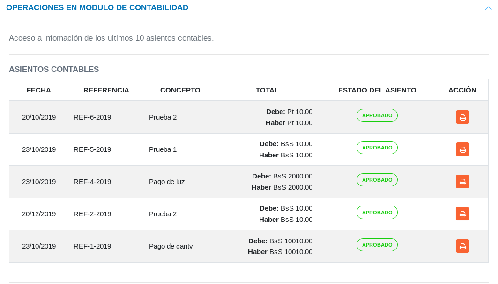

#Panel de Control Módulo de Contabilidad
****************************************

##Operaciones módulo de contabilidad

A través del **Panel de Control** es posible realizar un seguimiento de los asientos contables registrados en el sistema a partir de la sección de **Operaciones en Módulo de Contabilidad** del **Panel de Control**.   En esta sección se muestra en forma tabulada registros de los asientos contables con información relacionada con la fecha de registro, referencia, concepto referente a la operación, total relacionado con la partida doble (debe y haber del asiento) y el estado  del asiento contable. Es posible generar una copia del asiento contable haciendo uso del botón ubicado en la columna titulada **Acción** para obtener más detalles. 

Figura 36: Asientos Contables

##Reportes de contabilidad

El **Panel de Control** permite visualizar los diferentes reportes generados a partir del módulo de contabilidad.    En la sección de **Reportes de Contabilidad** se muestra de forma tabulada los reportes generados e información relacionada a cada uno de ellos. 

Figura 37: Reportes de Contabilidad

Los reportes son generados desde el **Módulo de contabilidad**, y a través del **Panel de Control** es posible visualizar detalles de estos reportes generando una copia del reporte haciendo uso del botón ubicado en la columna titulada **Acción**. 

