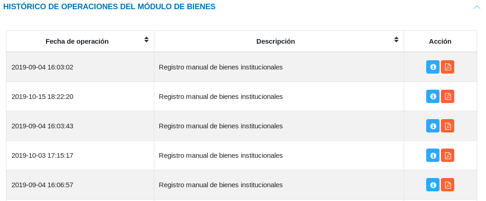

#Panel de Control Módulo de Bienes 
**********************************

##Gráficos del inventario de bienes 

El **Panel de Control** presenta una sección relacionada con los bienes institucionales.  La sección de **Gráficos del Inventario de Bienes Institucionales**, representa la cantidad de recursos en función de los bienes institucionales. Es posible seleccionar los datos que el sistema representará gráficamente, ya sean bienes existentes, más solicitados o menos solicitados, haciendo uso de los botones de selección. 

Figura 38: Gráficos del Inventario de Bienes

El sistema permite seleccionar un modo de visualización de gráficas, ya sea gráfica de barras, circular o lineal (estas gráficas son configuradas previamente por el desarrollador en el **Panel de Control**). 

##Historial de operaciones módulo de bienes

El sistema permite contar con un seguimiento de las operaciones en el **Módulo de Bienes**, a través de la sección **Histórico de Operaciones del Módulo de Bienes**. Los datos tabulados muestran una descripción y fecha de la operación, haciendo uso de los botones ubicados en la columna titulada **Acción**, donde es posible generar un reporte y ver más detalles de la operación.      

Figura 39: Historial de Operaciones en el Módulo de Bienes

