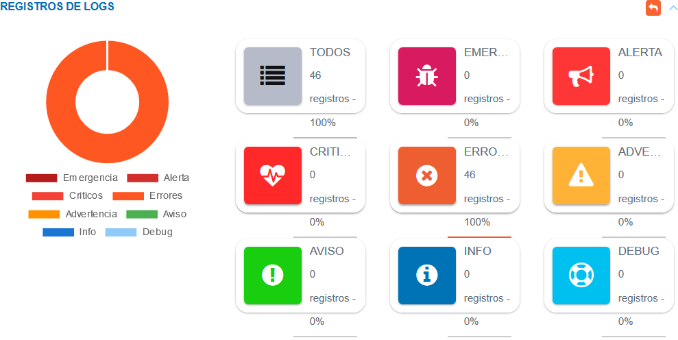

#Panel de Control Módulo de Almacén  
***********************************

##Módulo de almacén 

El **Panel de Control** permite llevar un seguimiento de las operaciones que se llevan a cabo sobre el módulo de almacén.  La sección del **Estado del Inventario** permite visualizar la disponibilidad de productos expresado en términos porcentuales, además de expresar estos datos de manera gráfica, en la sección de **Gráficos del Inventario de Productos en Almacén**. 

Figura 31: Estado del Inventario de Almacén

A través de la sección **Histórico de Operaciones del Módulo de Almacén** es posible observar cada una de las operaciones registradas sobre el módulo. Los datos tabulados muestran una descripción y fecha de la operación, desde esta tabla de registros es posible generar reportes y ver información detallada sobre las operaciones haciendo uso de los botones ubicados en la columna titulada **Acción**.

Figura 32: Histórico de Operaciones del Módulo de Almacén

