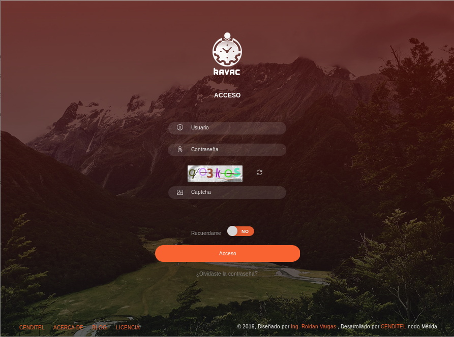
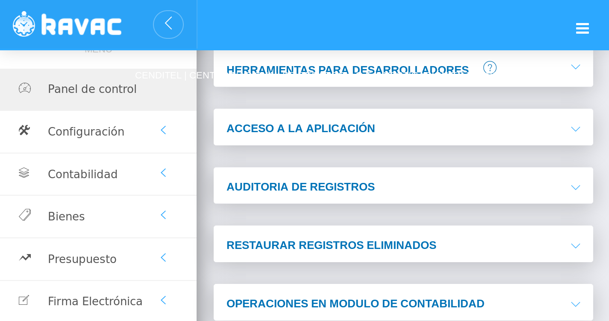

# Información General
*********************

## Antecedentes

### Experiencia de CENDITEL en el desarrollo de sistemas de gestión

  
   En el año 2005 se inició desde FUNDACITE-Mérida el desarrollo de un Sistema Administrativo dirigido a los entes descentralizados de la Administración Pública Nacional, un proyecto sustentado en el artículo 110 de la Constitución de la República Bolivariana de Venezuela, donde se reconoce como de interés público la ciencia, la tecnología, el conocimiento, la innovación y los servicio de información.

   Esta política en materia tecnológica fue apoyada también por el decreto 3.390, publicado en el año 2004 donde se insta a las instituciones gubernamentales a utilizar el Software Libre, fortalecido posteriormente con la Ley de Infogobierno promulgada en el año 2013.

   Este sistema administrativo se denominó en un primer momento Gestión Pública, para el año 2006, con la publicación de la primera versión estable, cambió su nombre a Sistema Administrativo Integrado Descentralizado (SAID), un software que automatiza los procesos administrativos asociados a la gestión de presupuesto y gastos de los entes descentralizados.

   Con la creación del Centro Nacional de Desarrollo e Investigación CENDITEL - Nodo Mérida, en el año 2007, el desarrollo del Sistema de información paso a manos de CENDITEL, quién se encargó de desarrollar nuevos módulos, realizar jornadas de capacitación a nivel de usuario, administración y desarrollo del sistema.

   El SAID es software libre y utiliza el modelo cliente-servidor, mientras que los módulos asociados a la gestión de los recursos económicos están ajustados a los instructivos de formulación y ejecución de presupuestos establecidos por la Oficina Nacional de Presupuesto -ONAPRE.

   Para más información:[tibisay.cenditel.gob.ve](https://tibisay.cenditel.gob.ve/sistema-administrativo-integrado/)

## Tecnología empleada

   KAVAC está siendo desarrollado en el lenguaje PHP y el framework Laravel bajo un esquema de programación orientada a objetos (POO) y una arquitectura cliente / servidor, el uso de este framework permite solventar algunas deficiencias del lenguaje en sí como lo es la gestión de grandes volúmenes de datos y cálculos inherentes a la información, con la implementación de métodos dispuestos en la capa ORM ( Object-Relational mapping) que optimizan la respuesta obtenida por el servidor de base de datos ante distintas magnitudes de consultas, además de contar con funciones que permiten realizar diferentes tareas enfocadas al mejor rendimiento de la aplicación.

   PHP es considerado uno de los lenguajes “open source” más utilizados en el desarrollo de aplicaciones web y el lenguaje primordial en la mayor parte de servidores de hospedaje. Como parte de su constante proceso de evolución, en sus últimas versiones (a partir de la 7.x) ha mejorado en cuanto a sintaxis (menos código por mismo resultado y mejoras en sus funcionalidades), rendimiento, de fácil configuración, con una amplia gama de paquetes disponibles para su uso libre y mejoras en el tratamiento de información.

   Laravel es un framework de desarrollo para PHP el cual cuenta con una gran cantidad de funcionalidades que permiten entre otras cosas: mejorar el rendimiento de los procesos, prevenir la exposición ante ataques conocidos, continua actualización en pro de mejoras sustanciales, amplia comunidad de desarrollo, núcleo basado en symfony, documentación sustancial en todos los componentes del framework, disponibilidad de cientos de paquetes “open source” que pueden ser implementados sin complejidad, configuración sencilla, gestión de recursos del servidor de aplicación y base de datos de una forma óptima, sintaxis intuitiva, entre otros.

   En el desarrollo de la aplicación administrativa para la gestión de recursos KAVAC se plantea implementar, en cuanto a la optimización de algunos procesos que requieren cálculos a gran escala, el uso de:

   1. Procedimientos almacenados: No dependen del lenguaje de desarrollo sino de la capacidad del gestor de base de datos en las tareas de cálculo y gestión de la información.

   2. Tareas programadas o delegadas: Permite delegar tareas de cómputo a la capacidad de cálculo del servidor sin obstruir el funcionamiento de la aplicación. 

   3. Interacción directa con el servidor: Posibilidad de interactuar directamente con el servidor de base de datos sin depender del lenguaje de desarrollo acelerando el proceso de consulta y gestión de la información.
    
   4. Disparadores de eventos: Generar notificaciones al usuario cuando una tarea haya sido culminada por el servidor.
   
   5. Gestión de cache: Almacenar información en la cache del servidor para no repetir consultas cada vez que esta sea solicitada a menos que la misma haya sido modificada, lo cual permitirá tiempos de respuesta casi imperceptibles.
   
   6. Configuraciones sugeridas en un entorno en producción de aplicaciones web
 
   7. Lenguaje de Desarrollo: Optimización de las variables de configuración dispuestas por el lenguaje para mejorar su rendimiento y aumentar las capacidades del mismo (aplica para cualquier lenguaje de desarrollo).
   
   8. Clúster de Servidores de Base de Datos: Permite la optimización y mejoras en cuanto al tiempo de respuesta en la capacidad de cálculo. Importante tomar en cuenta para la gestión de grandes volúmenes de datos pero no limitativo.
   
   9. Balanceo de Cargas: Configuración de un esquema de cargas balanceadas tanto en la capa del servidor de aplicación.
## Instalación del sistema   

###Pre-requisitos

   A continuación se listan los paquetes previos requeridos para la instalación y correcto funcionamiento de la aplicación:

    
    > PHP >= 7.2.x.
    > PHP-gd.
    > PHP-mbstring.
    > PHP-tokenizer.
    > PHP-zip.
    > PHP-pgsql.
    > PHP-cli.
    > PHP-curl.
    > Composer.
    > Zip.
    > Unzip.
    > Nodejs.
    > Postgresql.
    > Servidor de aplicaciones nginx, apache, etc.
    

###Glosario

   (ruta-absoluta-de-instalacion): Es la ruta en donde se va a instalar la aplicación, colocando la misma sin los (), por ejemplo:
     
    > /srv/kavac/
       
   (version-php-instalada): Es la versión del o los paquetes de PHP instalados, colocando la misma sin los (), por ejemplo:
   
    > 7.2 o en su defecto 7.3 

###Configuración del Servidor de Aplicaciones

   En esta documentación se explica cómo configurar un servidor de aplicaciones Nginx (para otro tipo de servidor se debe consultar la documentación pertinente para una configuración óptima en aplicaciones basadas en PHP).

###Instalar Nginx

   Lo primero que se debe realizar es la instalación del servidor de aplicaciones con el comando:

    > apt install nginx

   Una vez completada la instalación, inicie el servicio nginx y agréguelo para que se inicie automáticamente con el sistema operativo mediante el comando systemctl:

    > systemctl start nginx

    > systemctl enable nginx

   El servidor Nginx se ejecutará en el puerto 80, para verificar si se ejecutó correctamente debe ejecutar el comando:

    > netstat -plntu

   Si todo lo muestra correctamente, nginx estará instalado y en ejecución.

###Instalar PHP-FPM

   Para instalar la extensión FPM (FastCGI Process Manager) de la versión de PHP instalada en el sistema operativo se debe ejecutar el comando:

    > apt install php-fpm

   El próximo paso es configurar el archivo php.ini de FPM, para lo cual se debe acceder a la ruta en donde fue instalado, por lo general esta ruta se encuentra en /etc/php/(version-php-instalada)/, para esto se debe editar ejecutando:

    > nano/etc/php/(version-php-instalada)/php.ini , donde (version-php-instalada) es la versión de php 
      instalada en el servidor.

   En el contenido del archivo se debe buscar y descomentar la variable cgi.fix_pathinfo=1 y cambiar el valor a 0.

    > cgi.fix_pathinfo=0

   Guardar las modificaciones realizadas e inicializar el servicio FPM con los comandos:

    > systemctl start php(version-php-instalada)-fpm
    > systemctl enable php(version-php-instalada)-fpm

   El primer comando inicializa el servicio y el segundo lo habilita para que se ejecute automáticamente al arrancar el servidor.

   Por defecto en sistemas operativos como Ubuntu el servicio PHP-FPM se ejecuta bajo un archivo socket, para verificar que el servicio PHP-FPM se haya inicializado correctamente deberá escribir el comando netstat de la siguiente forma:

    > netstat -pl | grep php(version-php-instalada)-fpm

   Con lo anterior, el servidor virtual para la aplicación fue creado, solo queda reiniciar el servidor nginx para que las modificaciones tengan efecto, para esto se debe ejecutar:

    > systemctl restart nginx

###Configurar el servidor virtual de Nginx

   Para que la aplicación se ejecute en el servidor de aplicaciones Nginx, se debe realizar una configuración adicional creando para ello un archivo que contendrá dicha configuración, para esto se ejecutará el siguiente comando:

    > nano /etc/nginx/sites-available/kavac

     > Se agregará el siguiente contenido:
   
            server {

                listen 80;
                Descomentar si las peticiones solo aceptan el protocolo ipv6
                listen [::]:80 ipv6only=on;

                Log files for Debugging
                access_log /var/log/nginx/kavac-access.log;
                error_log /var/log/nginx/kavac-error.log;

                Webroot Directory for kavac project
                root (ruta-absoluta-de-instalacion)/public;
                index index.php index.html index.htm;

                Your Domain Name
                server_name (nombre-de-dominio-que-atiende-las-peticiones);

                location / {
                try_files $uri $uri/ /index.php?$query_string;
                } 
        
                PHP-FPM Configuration Nginx
                location ~ \.php$ {
                        try_files $uri =404;
                        fastcgi_split_path_info ^(.+\.php)(/.+)$;
                        fastcgi_pass unix:/run/php/php(version-php-instalada)-fpm.sock;
                        fastcgi_index index.php;
                        fastcgi_param SCRIPT_FILENAME $document_root$fastcgi _script_name;
                        include fastcgi_params;
                }
            
                Guardar las modificaciones y cierra el archivo.
            }
   
   Ahora para activar el servidor virtual se debe crear un enlace simbólico al archivo de configuración de la siguiente forma:

    > ln -s /etc/nginx/sites-available/kavac /etc/nginx/sites-enabled/

   Para que estos cambios tengan efecto se debe reiniciar el servidor de aplicaciones:

    > systemctl restart 

###Instalación

   Para poder ejecutar la instalación es importante contar con el paquete [composer](https://getcomposer.org/) el cual permite gestionar las distintas dependencias y/o paquetes requeridos por el sistema y una conexión externa a Internet. Cabe destacar que para mejores resultados, se debe tener instalado composer de manera global.

   Por otro lado, se requiere contar con el paquete NodeJS para gestionar los paquetes requeridos para la reactividad en la gestión de datos de algunos procesos, para lo cual se requiere seguir la documentación de [nodejs](https://nodejs.org/) para el sistema operativo en el que se vaya a ejecutar la aplicación.

   Abrir un terminal y posicionarse en la ruta base del proyecto "/", luego ejecuta la siguiente instrucción:

    > composer install

   Una vez instalada la aplicación, ejecuta el comando:

    > php artisan key:generate

   Esto generará un identificador único para la aplicación y creará (si no existe), el archivo de configuración .env, en caso de que no se genere dicho archivo, se debe ejecutar el comando:

    > cp .env.example .env

   Luego se debe repetir el paso anterior.

   Para un mejor rendimiento de la aplicación en entornos de producción se recomienda utilizar el comando:

    > composer install --optimize-autoloader --no-dev

   Esto permitirá una carga más optimizada de los componentes del sistema.
 
   En el archivo .env, localizado en la raíz del sistema, se deben establecer los parámetros de configuración necesarios bajo los cuales se ejecutará la aplicación.

     > APP_NAME
     > APP_ENV
     > APP_KEY
     > APP_DEBUG
     > APP_LOG_LEVEL
     > APP_URL
     > 
     > DB_CONNECTION
     > DB_HOST
     > DB_PORT
     > DB_DATABASE
     > DB_USERNAME
     > DB_PASSWORD
     > 
     > BROADCAST_DRIVER
     > CACHE_DRIVER
     > SESSION_DRIVER
     > QUEUE_DRIVER
     > 
     > REDIS_HOST
     > REDIS_PASSWORD
     > REDIS_PORT
     > 
     > MAIL_DRIVER
     > MAIL_HOST
     > MAIL_PORT
     > MAIL_USERNAME
     > MAIL_PASSWORD
     > MAIL_ENCRYPTION
     > 
     > PUSHER_APP_ID
     > PUSHER_APP_KEY
     > PUSHER_APP_SECRET
     > PUSHER_APP_CLUSTER     

   De igual manera se debe instalar los paquetes necesarios para la gestión reactiva de datos, para lo cual se debe ejecutar el siguiente comando (teniendo en cuenta que se debe contar con nodejs y npm previamente instalados):

    > npm install

   El comando anterior instala todas las dependencias de node requeridas por el sistema.
   
   El último paso en el proceso de instalación es modificar los usuarios y permisos para el acceso del servidor a la aplicación KAVAC, para lo cual le indicamos la permisología y usuario correspondiente.

    > chown -R www-data:root (ruta-absoluta-de-instalacion)
    > chmod 755 (ruta-absoluta-de-instalacion)/storage 

###Base de datos

   El Sistema Administrativo KAVAC puede ser ejecutado con diferentes gestores de Base de Datos tales como PostgreSQL, MySQL, SQLite, entre otros, sin embargo se recomienda el uso del gestor de Base de Datos PostgreSQL por su capacidad en la gestión de información.

   Debe crear una base de datos en el gestor de su preferencia y configurarlo en el archivo .env con los datos de 
   acceso. Ejemplo:
   
     DB_CONNECTION=pgsql
     DB_HOST=localhost
     DB_PORT=5432
     DB_DATABASE=kavac
     DB_USERNAME=kavac
     DB_PASSWORD=kavac
   
   Una vez configurado el gestor de base de datos, se debe ejecutar el siguiente comando:    
   
    > php artisan migrate

   Lo anterior creará la estructura de tablas de la base de datos necesaria para comenzar a gestionar la información. 

###Registros iniciales
    
   KAVAC, cuenta con información inicial requerida para la gestión de la aplicación, para lo cual se debe ejecutar el comando:

    > php artisan db:seed

   El anterior comando ejecutara las acciones necesarias para ingresar al sistema los datos inicialmente requeridos por la aplicación base como son: usuario, roles, permisos, localidades, estados civiles, profesiones, sectores de instituciones y tipos de instituciones.

   La aplicación cuenta con una cantidad de módulos independientes que permiten expandir sus funcionalidades, cada uno de estos módulos cuentan con sus registros iniciales por lo que es necesario ejecutar un comando adicional que permita registrar información de cada módulo instalado y habilitado en el sistema, para ello se ejecuta el siguiente comando:

    > php artisan module:seed

   Esto revisará que módulos del sistema están habilitados y procederá a registrar la información requerida, inicialmente, por cada uno de ellos.

   Una vez que hayan sido registrado los datos iniciales del sistema, se puede autenticar en el mismo con los siguientes datos de acceso como administrador (es recomendable modificar la contraseña en el primer acceso al sistema):

    > Usuario: admin
    > Clave: 123456

   El primer paso, para el correcto funcionamiento del sistema, es registrar información básica de la institución que llevará a cabo la gestión de información dentro de la aplicación, para ello se debe ingresar al menú:

    > Configuración > General

   En el panel "CONFIGURAR INSTITUCIÓN" se deben indicar los datos de la Institución, una vez configurada la institución se mostrarán todas las opciones de los módulos disponibles en el sistema.

###Probando la aplicación
   
   Para identificar si la aplicación se encuentra correctamente instalada, puedes ejecutar el comando de artisan que te permite levantar un servidor en entornos de desarrollo de la siguiente forma:

    > php artisan serve

   Este comando levanta un servidor en la dirección ip 127.0.0.1 o localhost y en el puerto 8000, para verificarlo puedes acceder a el enlace (127.0.0.1:8000)

   Puedes, de igual forma asignarle una dirección IP o dominio a este comando y un puerto en donde atenderá las peticiones para lo cual se puede agregar las opciones --host y/o --port, un ejemplo de su uso sería:

    > php artisan serve --port 192.168.1.1 --port 9000

###Comandos básicos laravel-modules

   Ejecutar las migraciones laravel-modules:

    > php artisan module:migrate

   Crea un nuevo modelo para el módulo especificado junto con su migración:

    > php artisan module:make-model -m ModuleNameModelName ModuleName

   Genera nuevo controlador restful para el módulo especificado:

    > php artisan module:make-controller ModuleNameModelName ModuleName

   Genera nuevo seeder para el módulo especificado (nombre del modelo en plural):

    > php artisan module:make-seed ModuleNameModelName ModuleName

## Interfaz gráfica

###Página de ingreso
   
   El sistema kavac cuenta con una página inicial de entrada, correspondiente a la ventana de ingreso y verificación de datos de usuarios. La estructura de esta página inicial está formada por una imagen de fondo, una serie de campos de verificación correspondientes a la cuenta de usuario, contraseña y un campo de verificación de captcha. El campo de verificación de captcha se completa conforme al texto descrito en la imagen, dicha imagen tiene la posibilidad de ser actualizada para mejorar la visualización del texto descrito. Los botones de selección permiten recordar contraseña al momento de un nuevo inicio de sesión.

###Elementos de identificación

   Dentro de los elementos de identificación como componentes de nuestra interfaz gráfica se encuentra el logo original y título del sistema kavac.

###Página inicial

   Página inicial o área de trabajo, se encuentra estructurada por una serie de elementos de navegación conformando el sistema y haciéndolo intuitivo a través de una barra de navegación superior, un panel lateral o menú del sistema, y el panel principal de operaciones.

###Panel superior

   Panel superior o barra de navegación, cuenta en su parte derecha con el logo kavac y un botón de despliegue para ocultar y mostrar el panel lateral, en la parte izquierda se muestran una serie de herramientas funcionales como lo son: buzón de mensajería, selector de idioma, configuración de base de datos y configuración de cuenta usuario.

###Panel lateral

   Panel lateral o menú del sistema, ubicado al lado derecho de la pantalla es la barra de navegación principal del sistema donde se ubican cada uno de los módulos o aplicaciones, cada módulo posee un botón con opción de despliegue para las subcategorías en que se divide dicho módulo.

###Panel principal

   Panel principal, es la ventana de operaciones en general de todas las actividades realizadas, cuenta con barras de navegación o buscadores, tablas de contenido en forma clasificada, gráficos y campos de registros. Se encuentra identificado en la parte superior de la ventana dependiendo el área en la que se está trabajando. El contenido incluido en este panel puede ser editado a través de una serie de elementos (botones) que se describen más adelante.

