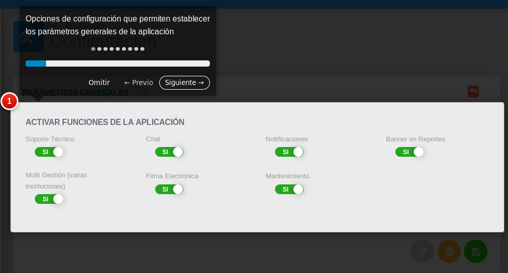

# Información General
*********************

## Tecnología empleada

   KAVAC se desarrolla en lenguaje PHP y el framework Laravel bajo un esquema de Programación orientada a objetos (POO) y una arquitectura cliente - servidor, el uso de este framework permite solventar algunas deficiencias del lenguaje en sí como lo es la gestión de grandes volúmenes de datos y cálculos inherentes a la información, con la implementación de métodos dispuestos en la capa ORM (mapeo objeto-relacional) que optimizan la respuesta obtenida por el servidor de base de datos ante distintas magnitudes de consultas, además de contar con funciones que permiten realizar diferentes tareas enfocadas al mejor rendimiento de la aplicación.

   PHP es considerado uno de los lenguajes Open Source más utilizados en el desarrollo de aplicaciones web y es el lenguaje primordial en la mayor parte de servidores de hospedaje. Como parte de su constante proceso de evolución, en sus últimas versiones (a partir de la 7.x) ha mejorado en cuanto a sintaxis (menos código por el mismo resultado y mejoras en sus funcionalidades), rendimiento, de fácil configuración, con una amplia gama de paquetes disponibles para su uso libre y mejoras en el tratamiento de información.

   Por su parte, Laravel es un framework de desarrollo para PHP el cual cuenta con una gran cantidad de funcionalidades que permite: mejorar el rendimiento de los procesos, prevenir la exposición ante ataques conocidos, continua actualización en pro de mejoras sustanciales, amplia comunidad de desarrollo, núcleo basado en Symfony, documentación sustancial en todos los componentes del framework, disponibilidad de una gran diversidad de paquetes Open Source que pueden ser implementados sin complejidad, configuración sencilla, gestión de recursos del servidor de aplicación,  base de datos de una forma óptima y sintaxis intuitiva.

   En el desarrollo de la aplicación administrativa para la gestión de recursos KAVAK se plantea implementar, en cuanto a la optimización de algunos procesos que requieren cálculos a gran escala, el uso de:

  
   - Procedimientos almacenados: No dependen del lenguaje de desarrollo sino de la capacidad del gestor de base de datos en las tareas de cálculo y gestión de la información.

   - Tareas programadas o delegadas: Permite delegar tareas de cómputo a la capacidad de cálculo del servidor sin obstruir el funcionamiento de la aplicación. 

   - Interacción directa con el servidor: Posibilidad de interactuar directamente con el servidor de base de datos sin depender del lenguaje de desarrollo acelerando el proceso de consulta y gestión de la información.
    
   - Disparadores de eventos: Generar notificaciones al usuario cuando una tarea haya sido culminada por el servidor.
   
   - Gestión de caché: Almacenar información en la caché del servidor para no repetir consultas cada vez que esta sea solicitada a menos que la misma haya sido modificada, lo cual permitirá tiempos de respuesta casi imperceptibles.
   
   - Configuraciones sugeridas en un entorno en producción de aplicaciones web
 
   - Lenguaje de Desarrollo: Optimización de las variables de configuración dispuestas por el lenguaje para mejorar su rendimiento y aumentar las capacidades del mismo (aplica para cualquier lenguaje de desarrollo).
   
   - Clúster de Servidores de Base de Datos: Permite la optimización y mejoras en cuanto al tiempo de respuesta en la capacidad de cálculo. Importante tomar en cuenta para la gestión de grandes volúmenes de datos pero no limitativo.
   
   - Balanceo de Cargas: Configuración de un esquema de cargas balanceadas tanto en la capa del servidor de aplicación.

## Interfaz gráfica

Página de ingreso
   
   La ventana de ingreso está formada por una imagen de fondo, una serie de campos de verificación correspondientes a la cuenta de usuario, contraseña y un campo de verificación de captcha. El campo de verificación de captcha se completa conforme al texto descrito en la imagen, dicha imagen tiene la posibilidad de ser actualizada para mejorar la visualización del texto descrito. Los botones de selección permiten recordar contraseña al momento de un nuevo inicio de sesión.

Elementos de identificación

   Dentro de los elementos de identificación como componentes de nuestra interfaz gráfica se encuentra el logo original y título del sistema KAVAC.

Página inicial

   Página inicial o área de trabajo, se encuentra estructurada por una serie de elementos de navegación conformando el sistema y haciéndolo intuitivo a través de una barra de navegación superior, un panel lateral o menú del sistema, y el panel principal de operaciones.

Panel superior

   Panel superior o barra de navegación, se distribuye de la siguiente manera, en la parte izquierda se muestra el logo KAVAC y un botón de despliegue para ocultar y mostrar el panel lateral, a la derecha se muestran una serie de herramientas funcionales como lo son: buzón de mensajería, <!-- selector de idioma --> configuración de base de datos y configuración de cuenta usuario.

Panel lateral

   Panel lateral o menú del sistema, ubicado al lado izquierdo es el menú principal del sistema donde se ubican cada uno de los módulos o aplicaciones, cada módulo posee un botón con opción de despliegue para las subcategorías en que se divide dicho módulo.

Panel principal

   Panel principal, es la ventana de operaciones en general de todas las actividades a realizar y registradas, cuenta con barras de navegación, buscadores, tablas de contenido en forma clasificada, gráficos y campos de registro. Se encuentra identificado en la parte superior de la ventana dependiendo el área en la que se está trabajando. 

##Botones

   Dentro de los elementos funcionales comunes de la interfaz gráfica del sistema se encuentran los siguientes elementos:

Acciones de formulario

   Se muestran tres botones comunes para las ventanas del sistema, elementos que corresponden a las funciones de borrar datos, cancelar y guardar respectivamente.

Acciones de registro

   Estos elementos corresponden a las funciones de regresar, crear nuevo registro e imprimir respectivamente.

   
   Estos elementos corresponden a las funciones de editar, borrar, ver y aprobar registro respectivamente.

   Estos elementos corresponden a las funciones de buscar, subir y descargar datos respectivamente.

Botón de ayuda

   El botón de ayuda que observamos en el encabezado de algunas secciones es un elemento que tiene la función de guiar al usuario en el sistema a través de una documentación de usuario o un tutorial a nivel de interfaz gráfica.  

Guía tutorial

   En algunos casos el botón de ayuda nos dirige a la documentación de usuario, en su defecto, se mostrará un tutorial a nivel de interfaz gráfica paso a paso con especificaciones de las funcionalidades del sistema. 

##Sobre los usuario

Los usuarios afiliados y sus interacciones con el sistema son administradas a través de la funcionalidad de gestión de roles incorporada en el módulo de configuración, donde  se pueden crear roles y asignar los permisos correspondientes al mismo, garantizando así el acceso a la información de acuerdo a diversos niveles de seguridad. 

Usuarios asociados al sistema KAVAC:

Usuario:

El sistema registrará este actor sin ningún tipo de rol asignado, por consiguiente, tendrá acceso limitado a través del sistema.

Administrador:

El rol de usuario como administrador, le permitirá a este actor contar con una permisología completa sobre todo el sistema, es decir, el administrador es el actor más importante con acceso a todas las áreas del sistema, con el fin de desempeñar funciones como registro de nuevos usuarios, asignación de roles, concesión de permisología, aprobación o desaprobación de solicitudes entre otros.

Desarrollador:

El rol de usuario como desarrollador le permitirá a este actor contar con la permisología de acceso a las diferentes áreas relacionadas con asistencia técnica y funcionabilidad de la aplicación.

Otros usuarios:

Los roles de usuarios listados a continuación: soporte, contabilidad, bienes, presupuesto, finanzas, nómina, almacén, compra  le permitirá a cada usuario acceder a las funcionalidades relacionadas específicamente con los módulos respectivos a los que pertenecen como lo son: soporte técnico, contabilidad, bienes, presupuesto, finanzas, talento humano, almacén, compras. 

   

##Empezando a usar KAVAC

Editar perfil de usuario

Los registros y designación de roles son gestionados por el usuario administrador, sin embargo; el usuario puede realizar algunas acciones en su perfil de usuario como cambiar la contraseña y editar su foto de perfil.   Para ello es necesario ubicarse en el panel superior y dirigirse a la configuración de cuenta usuario.  En esta ventana se ubican la sección de directorio donde se presentan una lista de contactos de usuarios registrados en el sistema, la sección mensajes  muestra un historial de mensajería, y la sección de perfil muestra toda la información básica del usuario. 

   

Mensajería y notificaciones
   

En el panel superior o barra de navegación se muestran un icono correspondiente al buzón de mensajería y notificaciones, asociados a la cuenta usuario. 

<!-- ###Cambiar idioma 

El sistema KAVAC es bilingüe se muestra en español e inglés, para la configuración del idioma simplemente nos ubicamos en el panel superior e ingresamos al icono llamado idioma seguido del icono de mensajes.  -->  

Recibir ayuda

Para recibir ayuda en la gestión del sistema puede dirigirse al panel superior e ingresar en contactar soporte técnico para entrar a la plataforma de servicios del sistema KAVAC. 

<!-- 
 -->

