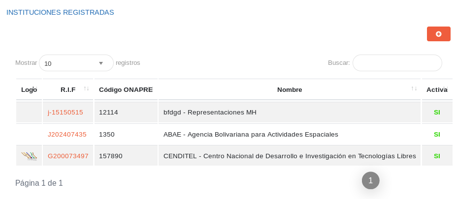

#Configuración General del Sistema  
**********************************

##Parámetros generales

En la sección de parámetros generales, el usuario con permisos sobre la **Configuración** del sistema puede controlar las funcionalidades de la aplicación, habilitando o deshabilitando funciones a través de los botones de selección (Figura 10). 

Estas funcionalidades permiten:

- Soporte Técnico: Mediante esta funcionalidad el sistema permite la comunicación con soporte técnico.

- Chat: Mediante esta funcionalidad el sistema activa la comunicación por chat interno.

- Notificaciones: Mediante esta funcionalidad el sistema activa las notificaciones del sistema. 

- Multi-Gestión: Mediante esta funcionalidad el sistema activa la gestión administrativa para el uso con múltiples instituciones.

- Mantenimiento: Mediante esta funcionalidad la aplicación se encontrará inactiva, se usa cuando es necesario realizar grandes cambios en el sistema.

- Firma electrónica: Mediante esta funcionalidad el sistema activa la firma electrónica para todos los procesos del sistema.

Figura 10: Parámetros Generales

Para ingresar  a esta sección es necesario:

- Acceder como usuario administrador o con un rol de usuario con permisos sobre la **Configuración** del sistema.
- Dirigirse desde el panel lateral a la **Configuración General** y ubicarse en la sección de **Parámetros generales**. 
- Haciendo uso de los botones de selección podemos activar o desactivar cualquiera de la funciones del sistema.
- Para ejecutar o cancelar cualquiera de los cambios hacemos uso de los [botones de acciones de formulario](/information/#botones), ubicados en la parte inferior de la sección. 

##Registros comunes

La sección de registros comunes es una herramienta de la **Configuración** que permite al usuario administrador o un usuario con permisos sobre la **Configuración** ajustar a través de parámetros preestablecidos, el sistema a la organización usuaria.   Los datos registrados en esta sección serán considerados a largo de todo el sistema.

Figura 11: Registros Comunes

##Registrar institución  

La **Configuración General del Sistema** incluye una sección titulada **Instituciones Registradas** (Figura 12) donde se muestra un historial de instituciones registradas e información relacionada a cada una de ellas, en esta sección además se puede registrar otra institución haciendo uso del botón de acción de registro.   

Presione el botón  para registrar una institución. 

Figura 12: Instituciones Registradas

Para realizar el registro de una Institución se debe:

- Acceder como usuario administrador o con un rol de usuario con permisos sobre la **Configuración General** del sistema.
- Ubicarse en la sección **Instituciones Registradas**.
- Haciendo uso del botón , ubicado en la esquina superior derecha de esta sección, accedemos al formulario de registro de institución. 
- Completar el formulario de **Registro de Institución**. 
- Presionar el botón **Guardar** ubicado al final de esta sección.
- Finalmente el registro se mostrará en el historial en la sección **Instituciones Registradas**. 	

##Configurar institución 

En la **Configuración General del Sistema** se presenta una sección para el **Registro** y **Configuración** de instituciones.  En la sección **Configurar Institución** (Figura 13) el usuario debe completar los campos obligatorios y requerimientos relacionados con las características organizacionales de la institución.   Antes de guardar el registro, en esta ventana el usuario puede completar datos adicionales relacionados con la estructura de la institución en la sección **Datos Complementarios**.  

Figura 13: Configurar Institución

Para configurar la institución se debe seguir los siguientes pasos: 

- Acceder como usuario administrador o con un rol de usuario con permisos sobre la **Configuración General** del sistema.
- Ubicarse en la sección **Configurar Institución**.
- Completar los datos básicos y complementarios de la institución.
- Presionar el botón **Guardar** ubicado al final de esta sección.

**Configurar Logos y banners institucionales** 

En la sección **Configurar Institución** de la **Configuración General del Sistema** podemos añadir el logotipo y el banner institucional.  Para adjuntar la imagen simplemente ingresamos en alguno de los recuadros, y el sistema nos conducirá a un directorio local para cargar la imagen. 

Figura 14: Logotipo y Banner Institucional

