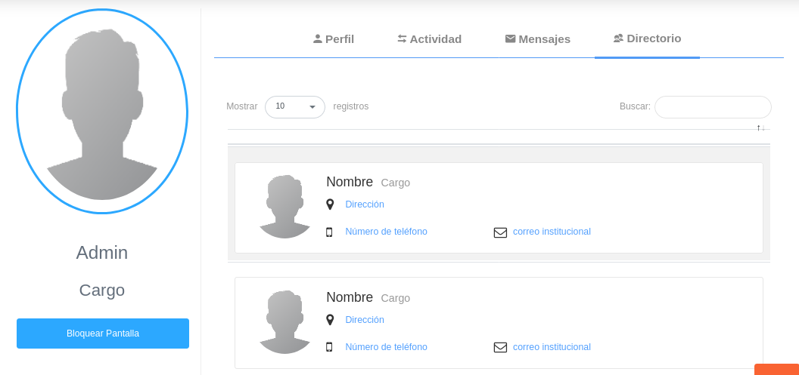

#Configuración Cuenta de Usuario  
********************************

Desde esta sección es posible llevar a cabo la gestión de cuenta de usuario como por ejemplo: cambiar contraseña, añadir foto de perfil, configurar bloqueo de pantalla, configurar notificaciones, entre otras funcionalidades que más adelante se describen.	Para ingresar a esta sección es necesario dirigirse al panel superior del sistema e ingresar en el apartado **Mi configuración y datos**. 

Figura 20: Configuración de Cuenta de Usuario

A continación se muestran las siguientes opciones: 

-	Configurar Cuenta. 
-	Mi Perfil.  
-	Ayuda.
-	Salir.

##Configurar cuenta 

A través de la configuración de cuenta de usuario es posible establecer algunos parámetros del sistema para esta cuenta de usuario. En este apartado se encuentra una sección para configuración **General** y una configuración de **Notificaciones**.

###General

En esta sección es posible activar la funcionalidad para **Bloqueo de Pantalla** y establecer un tiempo de duración en minutos.

Figura 21: Configuración General

Para activar la funcionalidad de **Bloqueo de Pantalla**:

- Dirigirse a **Mi configuración y datos** ubicado en el panel superior del sistema.
- Ingresar a **Configurar Cuenta** y ubicarse en la sección **General**.
- Activar a través del botón de selección la opción **Bloqueo de Pantalla**.
- Establecer tiempo de duración en minutos. 
- Presionar el botón **Guardar**  ubicado al final de esta sección para registrar los cambios.

###Notificaciones

En esta sección es posible activar o desactivar notificaciones generadas por el sistema. 
Una vez se active cualquiera de la opciones, se recibirán notificaciones cuando se cree, se edite o se elimine cualquier registro perteneciente a la opción seleccionada.   Las opciones disponibles son: Institución, Moneda, Deducción, Departamento, Documento, Intercambio de Moneda, Profesión e Impuesto. 

Figura 22: Configuración de Notificaciones

Para activar la funcionalidad de notificaciones:

- Dirigirse a **Mi configuración y datos** ubicado en el panel superior del sistema.
- Ingresar a **Configurar Cuenta** y ubicarse en la sección **Notificaciones**.
- Activar a través de los botones de selección las opciones para las que se desea recibir notificaciones.  
- Presionar el botón **Guardar**  ubicado al final de esta sección para registrar los cambios.

##Mi perfil

###Perfil

Desde esta sección es posible **cambiar contraseña**, **editar imagen de perfil** y **bloquear pantalla**. 

Figura 23: Perfil de Usuario
 

Para cambiar contraseña:

- Dirigirse a **Mi configuración y datos** ubicado en el panel superior del sistema.
- Ingresar a **Mi Perfil** y ubicarse en la sección **Perfil**.
- Completar los campos **Nueva Contraseña** y **Confirmar Contraseña**.  
- Presionar el botón **Guardar** ubicado al final de esta sección para registrar los cambios.  

Para cambiar imagen de perfil:

- Dirigirse a **Mi configuración y datos** ubicado en el panel superior del sistema.
- Ingresar a **Mi Perfil** y ubicarse en la sección **Perfil**.
- Dar clic sobre la imagen de perfil, y selecionar la nueva imagen.  
- Presionar el botón **Guardar** ubicado al final de esta sección para registrar los cambios.  

###Mensajes

En esta sección se aloja el buzón de mensajes.  

Figura 24: Mensajes
 

###Directorio

En esta sección se listan todos los usuarios registrados en el sistema con sus datos básicos como **nombre**, **dirección**, **número de teléfono** y **correo institucional**.

Figura 25: Directorio

##Bloquear pantalla 

A través de esta opción es posible hacer uso de la funcionalidad **Bloqueo de pantalla**. 

Figura 26: Bloqueo de Pantalla
 

!!! note "Nota"
	
	Esta funcionalidad debe estar activada y configurada previamente, de lo contrario se debe activar desde la sección **Configurar cuenta** para su correcto funcionamiento. 

##Ayuda

A través de esta opción el usuario tiene acceso a la documentación de usuario del sistema. 

Figura 27: Ayuda
 

##Salir

A través de esta opción el usuario cierra sesión en el sistema. 

Figura 28: Salir de la Aplicación
 

