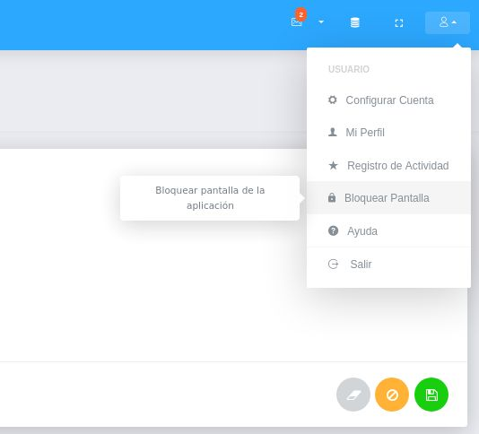
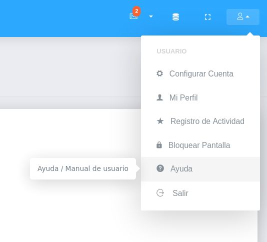
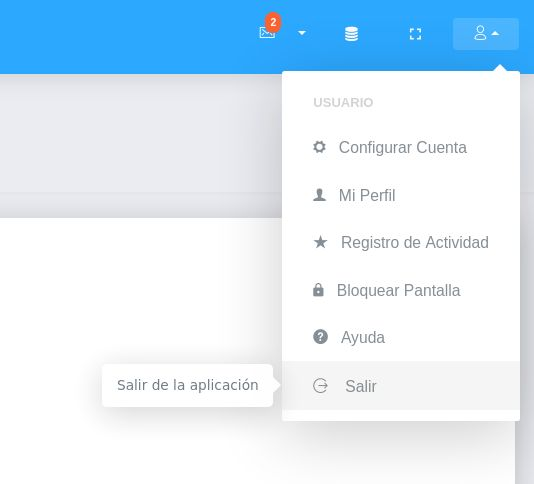

#Configuración Cuenta de Usuario  
********************************

##Mi configuración y datos

Desde esta sección es posible llevar a cabo la gestión de cuenta de usuario.  Para ingresar a esta sección es necesario dirigirse al panel superior del sistema e ingresar en el apartado **Mi configuración y datos**. 

Figura : Configuración de Cuenta de Usuario

A continación se muestran las siguientes opciones Configurar Cuenta, Mi Perfil, Registro de Actividad, Ayuda y Salir.

###Configurar cuenta 

A través de la configuración de cuenta de usuario es posible establecer algunos parámetros del sistema para esta cuenta de usuario. En este apartado se encuentra una sección para configuración **General** y una configuración de **Notificaciones**.

####General

En esta sección es posible activar la funcionalidad para **Bloqueo de Pantalla** y establecer un tiempo de duración en minutos

Figura : Configuración General

**Para activar la funcionalidad de Bloqueo de Pantalla**:

- Dirigirse a **Mi configuración y datos** ubicado en el panel superior del sistema
- Ingresar a **Configurar Cuenta** y ubicarse en la sección **General**
- Activar a través del botón de selección la opción **Bloqueo de pantalla**
- Establecer tiempo de duración en minutos 
- Presionar el botón **Guardar** ubicado al final de esta sección para registrar los cambios

####Notificaciones

En esta sección es posible activar notificaciones, el cual serán recibidas una vez se edite, se elimine o se cree un nuevo registro de los **Registros Comunes** del sistema para las opciones: Institución, Moneda, Deducción, Departamento, Documento, Intercambio de Moneda, Profesión e Impuesto. 

Figura : Configuración de Notificaciones

**Para activar la funcionalidad de notificaciones**:

- Dirigirse a **Mi configuración y datos** ubicado en el panel superior del sistema
- Ingresar a **Configurar Cuenta** y ubicarse en la sección **Notificaciones**
- Activar a través de los botones de selección las opciones para las que se desea recibir notificaciones  
- Presionar el botón **Guardar** ubicado al final de esta sección para registrar los cambios

###Mi perfil

####Perfil

Desde esta sección es posible Cambiar Contraseña, Editar Imagen de Perfil y Bloquear Pantalla. 

Figura : Perfil de Usuario
 

**Para cambiar contraseña**:

- Dirigirse a **Mi configuración y datos** ubicado en el panel superior del sistema
- Ingresar a **Mi Perfil** y ubicarse en la sección **Perfil**
- Completar los campos **Nueva Contraseña** y **Confirmar Contraseña**  
- Presionar el botón **Guardar** ubicado al final de esta sección para registrar los cambios  

**Para cambiar imagen de perfil**:

- Dirigirse a **Mi configuración y datos** ubicado en el panel superior del sistema
- Ingresar a **Mi Perfil** y ubicarse en la sección **Perfil**
- Dar clic sobre la imagen de perfil, y selecionar la imagen a subir  
- Presionar el botón **Guardar** ubicado al final de esta sección para registrar los cambios  

####Actividad

...

####Mensajes

En esta sección se aloja el buzón de mensajes  

####Directorio

En esta sección se listan todos los usuarios registrados en el sistema con sus datos básicos como Nombre, Dirección, Número de teléfono y Correo institucional. 

Figura : Directorio

###Registro de actividad

...

###Bloquear pantalla 

A través de esta opción es posible hacer uso de la funcionalidad **Bloqueo de pantalla**. 

Figura : Bloqueo de pantalla
 

!!! note "Nota"
	
	Esta funcionalidad debe estar activada y configurada previamente, de lo contrario se debe activar desde la sección **Configurar cuenta** para su correcto funcionamiento 

###Ayuda

A través de esta opción el usuario tiene acceso a la documentación de usuario del sistema. 

Figura : Ayuda
 

###Salir

A través de esta opción el usuario cierra sesión en el sistema. 

Figura : Salir de la Aplicación
 

