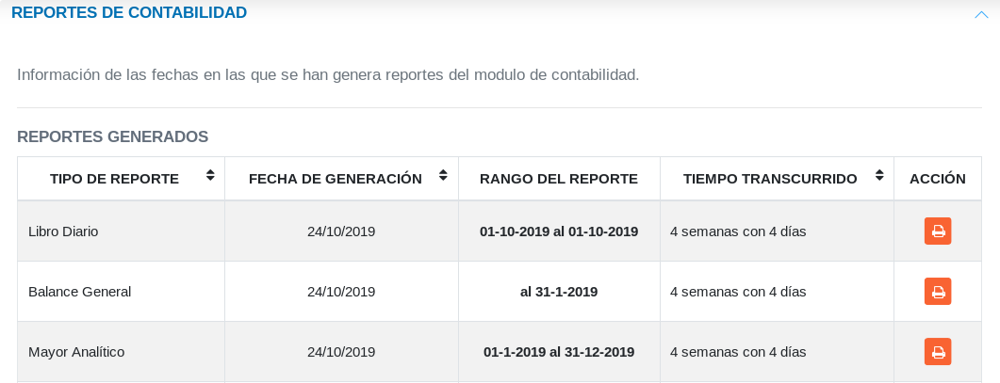

#Panel de Control Módulo de Contabilidad
****************************************

El módulo de **Contabilidad** incluye un **Panel de Control** para realizar seguimiento a las actividades desarrolladas desde el módulo, donde se incorporan las secciones **Operaciones del Módulo de Contabilidad** y **Reportes de Contabilidad**.

##Operaciones del módulo de contabilidad

A través de esta sección es posible realizar un seguimiento de los asientos contables registrados en el sistema, se muestra de forma tabulada los registros de asientos contables aprobados y no aprobados con información relacionada con la fecha de registro, referencia, concepto referente a la operación, total relacionado con la partida doble (debe y haber del asiento) y el estado  del asiento contable.

Figura 21: Asientos Contables

A través de la columna titulada **Acción** es posible generar un archivo con información sobre el registro para **Asientos Contables Aprobados** presionando el botón **Imprimir Registro**.

 **Imprimir Registro**.   

De la misma forma es posible **Aprobar**, **Editar** o **Eliminar** un registro para **Asientos Contables No Aprobados** haciendo uso de los botones de **Acciones de Registro**. 

##Reportes de contabilidad

El **Panel de Control** permite visualizar los diferentes reportes generados a partir del módulo de contabilidad.    En la sección de **Reportes de Contabilidad** se muestra de forma tabulada los reportes generados e información relacionada a cada uno de ellos. 

Figura 22: Reportes de Contabilidad
 

A través del botón **Imprimir Registro** ubicado en la columna titulada **Acción** es posible generar un archivo con información sobre cada registro. 

 **Imprimir Registro**. 

