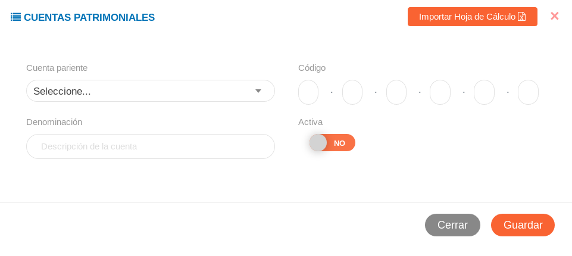

#Configuración módulo de contabilidad
*************************************

##Formatos de códigos 

La sección de **Formatos de Códigos** permite establecer un código de referencia para los registros posteriores (asientos contables), para completar esta configuración debemos dirigirnos al **Módulo de Contabilidad**, luego a **Configuración** y ubicarnos en la sección **Formatos de Códigos**.   

Para establecer el código de referencia es necesario seguir los parámetros que se muestran a continuación:  

El formato se establece de la siguiente manera: prefijo - digitos - año

- prefijo (requerido): 1 a 3 carácteres
- digitos (requerido): 6 carácteres (mínimo), 8 carácteres (máximo)
- año (requerido): 2 o 4 carácteres (YY o YYYY)

Longitud total máxima: 

Ejemplo: XXX-00000000-YYYY

Una vez se establezca el formato de códigos deseado se puede ejecutar cualquier cambio haciendo uso de los **Botones de Acciones de Formulario**, ya sea **Guardar**, **Cancelar** o **Borrar datos del formulario**.    

##Configuraciones del módulo de contabilidad

Las categorías de origen y el catálogo de cuentas corresponden a los registros iniciales, registros que serán usados en las demás secciones del módulo según la configuración que se realice. 

Para ingresar a esta configuración debemos dirigirnos al **Módulo de Contabilidad**, luego a **Configuración** y ubicarnos en la sección **Configuraciones del Módulo de Contabilidad**.  Al ingresar los registros iniciales pertinentes configuraremos el módulo según los requerimientos de cada institución.  

###Categorías de origen 

Esta sección esta orientada a la gestión de categorías de origen que generan un asiento contable.  Desde esta sección es posible crear una nueva categoría o gestionar alguna editando o eliminando una categoría registrada.

**Crear una nueva categoría:** 

- Dirgirse al **Módulo de Contabilidad**, luego a **Configuración**, ubicarse en **Configuraciones del Módulo de Contabilidad** e ingresar en **Categorías de Origen**
- Asignar un nombre y un acrónimo (maximo 4 carácteres) a la categoría
- Oprimir el boton **Guardar**
- Verificar que la categoría se muestre en la lista de **Registros** 

**Editar una categoría registrada** 

- Dirgirse al **Módulo de Contabilidad**, luego a **Configuración**, ubicarse en **Configuraciones del Módulo de Contabilidad** e ingresar en **Categorías de Origen**
- Ubicarse en los **Registros** de la sección **Categorías de Origen** 
- Desde la tabla de **Registros** nos ubicamos en la columna titulada **Acción** y haciendo uso de los botones que se ubican en esta columna podemos editar o elimar el registro

###Catálogo de cuentas

Esta sección permite listar las cuentas patrimoniales del sistema, importar cuentas patrimoniales desde una hoja de cálculo, crear un nuevo registro de una cuenta y gestionar una cuenta. 

**Crear un nuevo registro:**

- Dirgirse al **Módulo de Contabilidad**, luego a **Configuración**, ubicarse en **Configuraciones del Módulo de Contabilidad** e ingresar en **Catálogo de cuentas**
- Eligir una cuenta pariente
- Asignar un código tomando en cuenta su dependencia de la cuenta pariente 
- Asignar una denominación para la cuenta 
- Seleccionar el estado de la cuenta (si la cuenta se encuentra activa o no)
- Oprimir el boton **Guardar**
- Verificar que la cuenta se muestre en la lista de **Registros**

**Parámetros para asignación de código para un nuevo registro**

- Primer campo: grupo al que pertenece la cuenta
- Segundo campo: sub-grupo al que pertence la cuenta 
- tercer campo: rubro al que pertence la cuenta 
- cuarto campo: identificador de cuenta a la que pertenece
- quinto campo: identificador de cuentas de primer orden 
- sexto campo: identificador de cuentas de segundo orden

**Editar una cuenta registrada**

- Dirgirse al **Módulo de Contabilidad**, luego a **Configuración**, ubicarse en **Configuraciones del Módulo de Contabilidad** e ingresar en **Catálogos de cuentas**
- Ubicarse en los **Registros** de la sección **Catálagos de cuentas**
- Desde la tabla de **Registros** nos ubicamos en la columna titulada **Acción** y haciendo uso de los botones que se ubican en esta columna podemos editar o elimar el registro

**Importar cuentas desde una hoja de cálculo**

Se puede hacer una carga masiva importando una hoja de cálculo con nuestras cuentas patrimoniales, los formatos permitidos son csv, xls, xlsx, ods. El formato de hoja de cálculo debe ser el siguiente:

**Para importar una hoja de cálculo** 

- Dirigirse al **Módulo de Contabilidad**, luego a **Configuración**, ubicarse en **Configuraciones del Módulo de Contabilidad** e ingresar en **Catálogos de cuentas**
- En la sección **Cuentas Patrimoniales** presionar el boton **Importar Hoja de Cálculo**
- En esta nueva ventana podemos importar un archivo haciendo uso del boton que se muestra a continuación:

	

- Una vez cargado el archivo podemos **Guardar** los cambios y verificar el registro
	

