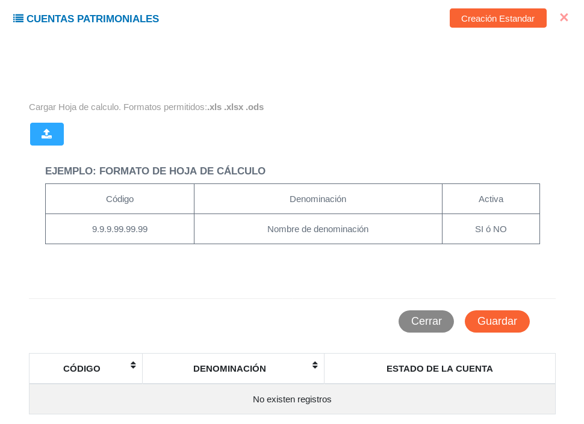
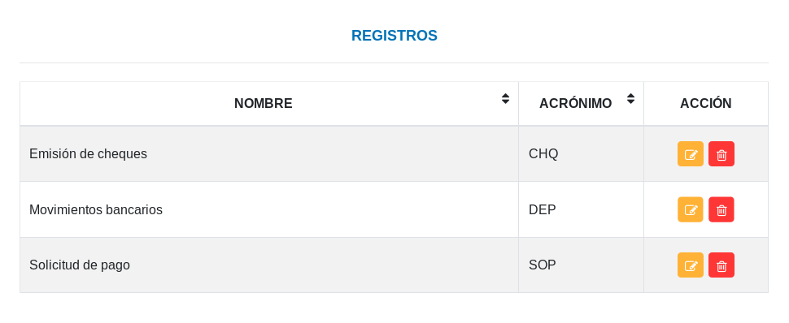
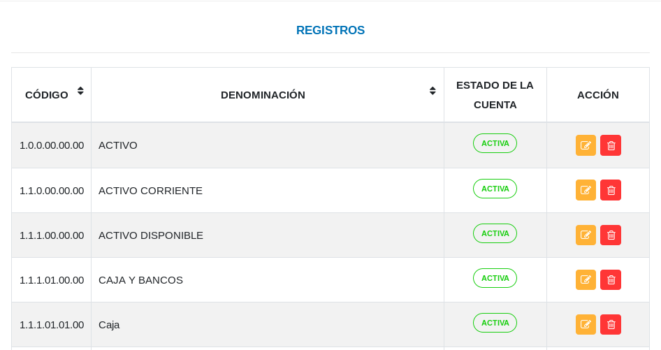

#Configuración Módulo de Contabilidad
*************************************

##Configuraciones del módulo de contabilidad

Las categorías de origen y el catálogo de cuentas corresponden a los registros iniciales, registros que serán usados en las demás secciones del módulo según la configuración que se realice. 

Figura 15: Configuración Módulo de Contabilidad

Para ingresar a esta configuración debemos dirigirnos al **Módulo de Contabilidad**, luego a **Configuración** y ubicarnos en la sección **Configuraciones del Módulo de Contabilidad**.  Al ingresar los registros iniciales pertinentes configuraremos el módulo según los requerimientos de cada institución.  

###Categorías de origen 

Esta sección está orientada a la gestión de categorías de origen que generan un asiento contable.  Desde esta sección es posible crear una nueva categoría o gestionar alguna, editando o eliminando una categoría registrada.

####Crear categoría 

- Dirigirse al **Módulo de Contabilidad**, luego a **Configuración**, ubicarse en **Configuraciones del Módulo de Contabilidad** e ingresar en **Categorías de Origen**.
- Asignar un nombre y un acrónimo (máximo 4 caracteres) a la categoría.
- Presionar el botón **Guardar**.
- Verificar que la categoría se muestre en la lista de **Registros**. 

Figura 16: Crear Categoría de Origen

Figura 17: Lista de Categorías de Origen

####Gestión de registros 

Para **Editar** o **Eliminar** un registro se debe hacer uso de los botones ubicados en la columna titulada **Acción** de la tabla de **Registros**.

###Catálogo de cuentas

Esta sección permite listar las cuentas patrimoniales del sistema, importar cuentas patrimoniales desde una hoja de cálculo, crear un nuevo registro de una cuenta y gestionar una cuenta. 

####Crear cuenta

- Dirigirse al **Módulo de Contabilidad**, luego a **Configuración**, ubicarse en **Configuraciones del Módulo de Contabilidad** e ingresar en **Catálogo de cuentas**.
- Elegir una cuenta pariente.
- Asignar un código tomando en cuenta su dependencia de la cuenta pariente. 
- Asignar una denominación para la cuenta. 
- Seleccionar el estado de la cuenta (si la cuenta se encuentra activa o no).
- Presionar el botón **Guardar**.
- Verificar que la cuenta se muestre en la lista de **Registros**.

Figura 18: Registro de Cuentas Patrimoniales

Figura 19: Lista de Cuentas Patrimoniales

Parámetros para asignación de código para un nuevo registro:

- Primer campo: grupo al que pertenece la cuenta.
- Segundo campo: subgrupo al que pertenece la cuenta. 
- Tercer campo: rubro al que pertenece la cuenta. 
- Cuarto campo: identificador de cuenta a la que pertenece.
- Quinto campo: identificador de cuentas de primer orden. 
- Sexto campo: identificador de cuentas de segundo orden.

####Gestión de registros 

Para **Editar** o **Eliminar** un registro se debe hacer uso de los botones ubicados en la columna titulada **Acción** de la tabla de **Registros**.

####Importar cuentas 

A tráves de esta funcionalidad es posible realizar un registro de carga masiva importando una hoja de cálculo de cuentas patrimoniales.	Para importar una hoja de cálculo se deben seguir los siguientes pasos:

- Dirigirse al **Módulo de Contabilidad**, luego a **Configuración**, ubicarse en **Configuraciones del Módulo de Contabilidad** e ingresar en **Catálogos de cuentas**.
- En la sección **Cuentas Patrimoniales** presionar el botón **Importar Hoja de Cálculo** ubicado en la esquina superior derecha de esta sección.
- Verificar el formato de hoja de cálculo a seguir para una correcta importación.
- Presionar el botón importar  para transferir una copia del archivo desde el ordenador a la aplicación.  
- Una vez cargado el archivo presionar el botón **Guardar** y verificar el registro.

!!! warning "Advertencia"
	Los formatos de archivo permitidos son csv, xls, xlsx y ods.

Figura 20: Importar Cuentas Patrimoniales

Si desea continuar haciendo el registro de forma convencional presione el botón **Creación Estandar** ubicado en la esquina superior derecha de esta sección (Figura 20).

