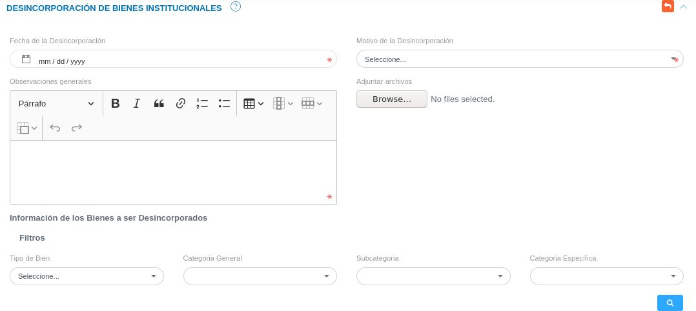

# Desincorporación de Bienes  
****************************

## Desincorporación de bienes 

La gestión para el retiro de bienes se lleva a cabo a través de la sección **Desincorporación de Bienes**, esta sección lista los registros de desincorporación realizados, permite crear un nuevo registro y a través de los botones ubicados en la columna titulada **Acción** de la tabla de registros, es posible visualizar la información de forma detallada, eliminar y modificar un registro.  

Figura 5: Bienes Desincorporados

###Crear una nueva desincorporación

- Dirigirse al **Módulo de Bienes**, luego a **Desincorporación** y ubicarse en la sección **Desincorporación de Bienes Institucionales**.
- Haciendo uso del botón **Crear**  ubicado en la esquina superior derecha de esta sección, se procede a realizar una nueva desincorporación.
- Se completa el formulario de la sección **Desincorporación de Bienes **, en el que es posible adjuntar varios archivos que justifiquen la desincorporación.  Los archivos permitidos son: odt, pdf, png, jpg, jpeg, doc y docx. 
- Se selecciona los bienes a desincorporar. 
- Se presiona el botón **Guardar**  y se verifica en la lista de registros la desincorporación.    

Figura 6: Desincorporar Bienes 

!!! note "Nota"
	En la parte inferior de esta sección (**Desincorporar Bienes **) se presenta los resultados filtrados una vez que el usuario completa la información de los bienes a ser  desincorporados y presiona el botón **Buscar**, si el usuario no introduce ningún parámetro asociado al bien y presiona el botón **Buscar**, el sistema presenta el listado de los bienes que pueden ser desincorporados.    

	Para desincorporar más de un bien, se hace uso del botón **Checkbox** ubicado en la primera columna de la tabla de registros, finalmente se presiona el botón **Guardar** para registrar la desincorporación.

	 **Buscar** 

###Gestión de registros

Para **Ver información detallada**, **Editar** o **Eliminar** un registro se debe hacer uso de los botones ubicados en la columna titulada **Acción** de la tabla de registros en la sección de **Desincorporación de Bienes **.

   