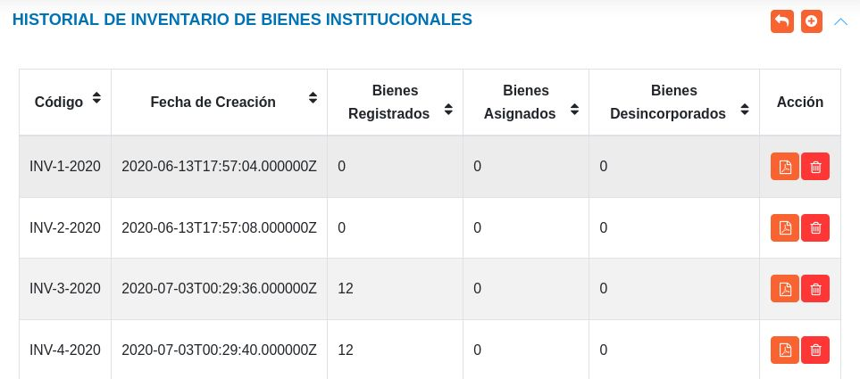

# Historial de Inventario de Bienes 
***********************************

## Historial de inventario de bienes 

A través de esta sección se gestiona el inventario de bienes.	En esta sección se listan todos los registros de inventario y a través de los botones ubicados en la columna titulada **Acción** es posible generar un reporte o eliminar el registro de inventario.  

Figura 13: Historial de Inventario de Bienes

Los reportes que se generan desde esta sección se dividen por tipo, ya sea: un reporte general, por clasificación o por dependencia. 

### Crear un nuevo registro de inventario 

- Dirigirse al **Módulo de Bienes**, luego a **Historial de Inventario** y ubicarse en la sección **Historial de Inventario de Bienes**.
- Haciendo uso del botón **Crear**  ubicado en la esquina superior derecha de esta sección, se guarda el estado actual del inventario.    
- Verificar que el registro de inventario se encuentre en la sección **Historial de Inventario de Bienes Institucionales**.

   