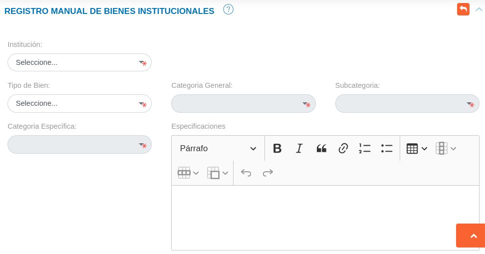

# Gestión de Registros de Bienes 
********************************

## Bienes institucionales 

En esta sección se listan todos los registros de bienes y se muestra información relevante sobre los mismos. La tabla de registros contiene datos del bien, como lo son: condición física, estatus de uso, serial, marca y modelo; también se muestra un código de registro y el nombre de la institución involucrada. 

Figura 1: Registros de Bienes

A través de los botones ubicados en la columna titulada **Acción** el encargado de bienes institucionales o usuario con permisos especiales puede: observar información detallada, asignar, desincorporar, editar o eliminar un bien registrado.   

### Crear un nuevo registro

- Dirigirse al **Módulo de Bienes**, luego a **Registros** y ubicarse en la sección **Bienes**.
- Haciendo uso del botón **Crear**  ubicado en la esquina superior derecha de esta sección, se procede a realizar un nuevo registro. 
- Se completa el formulario de la sección **Registro Manual de Bienes**.
- Se presiona el botón **Guardar**  para para completar el registro, y se verifica en la lista de registros.  

Figura 2: Registro Manual de Bienes

Este registro corresponde al método de forma manual, a través de esta funcionalidad es posible registrar solo un bien institucional.  Es importante considerar, que en el formulario de esta sección se solicita información asociada al bien (tipo de bien, categoría general de bien, subcategoría de bien, categoría específica de bien), que debe ser añadida previamente en la configuración del módulo. 	

!!! note "Nota"
	El **Estatus de uso** de cada Bien, define las acciones que se pueden ejecutar sobre dicho bien.  Por esta razón es importante considerar lo siguiente:

	*	Un bien debe tener el **Estatus de uso** definido como: "En almacén o Depósito para su asignación", para formar parte de una solicitud de préstamo.
	*	Un bien debe tener el **Estatus de uso** definido como: "En almacén o Depósito para su asignación", para ser asignado desde la sección de **Registros**.  Por otro lado es posible realizar la asignación manual de cualquier bien desde
	la sección **Asignaciones**.
	*	Si un bien posee cualquier **Estatus de uso** para desincorporación se supondrá que existe un registro de desincorporación asociado a este bien.   En este sentido no se recomienda registrar un bien inicialmente con un **Estatus de uso** de desincorporación, por otro lado; se recomienda realizar la desincorporación de forma manual a través de la tabla de registros de bienes o la sección de **Desincorporaciones**. 	  

### Importar registro

El sistema permite realizar una carga masiva de registros de bienes.	Para realizar esta importación de registros se debe tomar en cuenta seguir un formato de hoja de cálculo y cumplir con los formatos permitidos para la carga del archivo.

!!! warning "Advertencia"
	Los formatos permitidos para la carga de archivos son:  **csv**, **xls**, **xlsx** y **ods**.   

###Funcionalidad para importar registros

La carga de registros de forma masiva es una funcionalidad que se presenta en varios módulos de la aplicación. Es importante que el usuario encargado de hacer uso de esta funcionalidad tenga presente los parámetros y requerimientos a seguir para un correcto manejo de la misma. 

Se recomienda al usuario que va a importar un archivo; realizar antes una exportación de los registros (registros de bienes) que se encuentran en el sistema. Esto permitirá al usuario editar esta copia del archivo de registros y usar su infomarción para realizar una importación.    

El formato de hoja de cálculo establecido en el archivo a importar contiene una serie de columnas identificadas con los campos para el registro de bienes, si el usuario ha exportado un archivo, este mantiene sus columnas identificadas por defecto y no es necesario modificar un campo.

Cada uno de los campos asociados a un registro se encuentran identificados por un **id** el cual representa un identificador único.

A continuación se presenta una tabla con los siguientes registros: Dos tipos de bienes identificados por un id único, y las distintas categorías asociadas al tipo de bien identificadas por su respectivo id. 

|asset_type_id |asset_type |asset_category_id |asset_category|          
|---|---|---|---|  
|1 |Mueble  |1 |Maquinaria y demás equipos de construcción, campo, industria y taller|         
|  |        |2 |Equipos de transporte, tracción y elevación                          |         
|  |        |3 |Equipos de comunicaciones y de señalamiento                          |     
|  |        |4 |Equipos médicos - quirúrgicos, dentales y veterinarios               |         
|  |        |5 |Equipos científicos, religiosos, de enseñanza y recreación           |   
|  |        |6 |Equipos de defensa y seguridad del Estado                            |     
|  |        |7 |Máquinas, muebles y demás equipos de oficina y de alojamiento        |         
|  |        |8 |Semovientes                                                          |   
|2 |Inmueble|1 |Edificaciones, Tierras y Terrenos                                    |  

Los id son generados cada vez que se realiza un nuevo registro en la configuración del módulo y es posible visualizarlos una vez se exporte un archivo de registros (registros de bienes) desde el sistema. 

El archivo que el usuario ha exportado permite la edición de cualquier registro que se ha realizado previamente.  Sin embargo, el manejo de este contenido se debe realizar con precaución, ya que los registros pueden encontrase asociados a través de sus id (identificadores únicos).  

**Para Importar un registro**

- Dirigirse al **Módulo de Bienes**, luego a **Registros** y ubicarse en la sección **Bienes**.
- Haciendo uso del botón **Importar**  ubicado en la esquina superior derecha de esta sección, se procede a realizar la carga masiva.  
- Seleccionar el archivo del directorio local, para transferir a la aplicación.  
- Verificar que la información se haya almacenado en la lista de registros. 

###Exportar registro

La aplicación permite obtener una hoja de cálculo con todos los registros de bienes realizados, y la información asociada a cada uno. 

**Exportar registros**

- Dirigirse al **Módulo de Bienes**, luego a **Registros** y ubicarse en la sección **Bienes**.
- Haciendo uso del botón **Exportar**  ubicado en la esquina superior derecha de esta sección, se procede a la exportación de datos.  
- El sistema transfiere una copia del archivo desde la aplicación al equipo del usuario. Este archivo contiene todos los registros de bienes en el sistema.

###Gestión de registros 

A través de los botones ubicados en la columna titulada **Acción** de la tabla de registros de la sección **Bienes** es posible: **Ver información detallada**, **Asignar**, **Desincorporar**, **Editar** o **Eliminar** un bien registrado. 

 

!!! warning "Advertencia"
	Antes de editar o eliminar un registro, se debe tener precaución si existe algún registro de asignación o desincorporación asociado a este bien.  

   