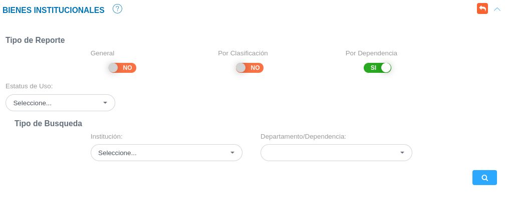

# Reportes de Bienes 
********************

## Generar reporte de bienes

La sección de reportes del módulo de bienes permite generar informes sobre los bienes, esta funcionalidad permite filtrar los bienes para los cuales se va a generar un reporte.   Es posible generar un reporte general, por clasificación, o por dependencia.   

Figura 14: Filtrar Registros de Bienes

El usuario puede ver todos los registros al presionar el botón **Buscar** y generar un reporte de cualquier tipo.

!!! note ""
     

###Filtrar los registros 

- En el reporte **General** los registros pueden ser filtrados por estatus de uso. 
- En el reporte **Por Clasificación** los registros pueden ser filtrados por estatus de uso, tipo de bien, categoría general, subcategoría, categoría específica.
- En el reporte **Por Dependencia** los registros pueden ser filtrados por estatus de uso, institución y departamento o dependencia. 

Una vez filtrados los registros de bienes es posible generar un reporte, haciendo uso del botón **Generar Reporte**, ubicado al final de la lista de registros.

!!! note "" 
    .

   