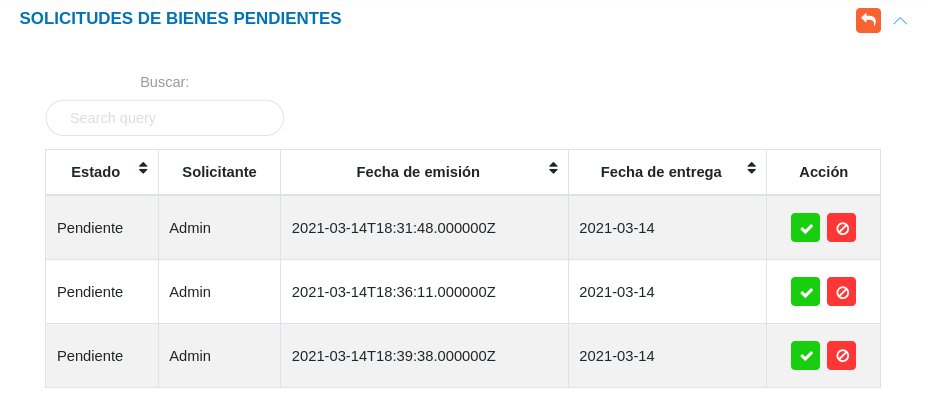
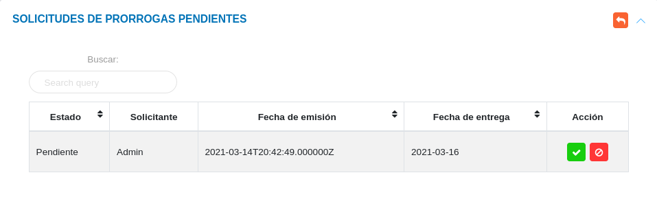

# Solicitudes de Bienes  
***********************

## Solicitudes de bienes

La gestión para préstamos de bienes se lleva a cabo a través de la sección **Solicitudes de Bienes**.	Esta sección lista los registros realizados, permite crear un nuevo registro y a través de los botones ubicados en la columna titulada **Acción** de la tabla de registros el usuario puede:  ver información detallada de la solicitud, solicitar prórroga, registrar eventos, entregar equipo, editar solicitud y eliminar registro. 

Figura 7: Solicitudes de Bienes

### Crear una nueva solicitud

!!! warning "Advertencia"
	*	Los bienes disponibles para la sección de solicitudes, son aquellos identificados bajo el **Estatus de uso** "En Almacén o Depósito para su asignación".  En caso de que un bien se encuentre asignado es necesario liberar este bien de dicha asignación y cambiar su estatus de uso, permitiendo así su disponibilidad para una solicitud.   

**Para crear un nuevo registro**

- Dirigirse al **Módulo de Bienes**, luego a **Solicitudes** y ubicarse en la sección **Solicitudes de Bienes**.
- Haciendo uso del botón **Crear**  ubicado en la esquina superior derecha de esta sección, se procede a realizar una nueva solicitud.
- Se completa el formulario de la sección **Solicitud de Bienes**.
- Elegir uno o más bienes a través del botón **Checkbox** ubicado en la primera columna de la tabla de registros.
- Se presiona el botón **Guardar**  y se verifica en la lista de registros de la sección **Solicitudes de Bienes**.   

!!! note "Nota"
	En el formulario de la sección **Solicitud de Bienes** es posible adjuntar uno o mas archivos asociados al registro de la solicitud.  Los formatos de archivos permitidos son: odt, pdf, doc y docx.

Figura 8: Solicitud de Bienes

Figura 9: Bienes

### Entrega de equipo 

La entrega de equipos se gestiona desde la tabla de **Solicitudes de Bienes**, haciendo uso de los botones ubicados en la columna titulada **Acción**, a través de estos botones es posible realizar las siguientes acciones: solicitar prórroga, reportar un suceso y entregar un equipo. 

!!! note ""
	 

#### Solicitar prórroga 

El usuario responsable del equipo puede solicitar una extensión de tiempo para la entrega del equipo, cabe destacar que el sistema solo permite una extensión de cuarenta y ocho horas adicionales. 

!!! info "Botón solicitar prorroga"
	 

#### Reporte de suceso

En caso de que el equipo de la solicitud presente algún desperfecto o se registró algún suceso que afectara al equipo, el usuario selecciona la opción **Registro de Eventos** y completa el formulario para realizar un reporte del evento.

!!! info "Botón reportar evento"
	 

#### Entrega de bienes  

A través de esta funcionalidad el usuario responsable notifica la entrega de equipos, el cual debe ser evaluada posteriormente por el encargado de bienes institucionales para su respectiva aprobación.  

!!! info "Botón entregar equipo"
	  

## Solicitudes de bienes pendientes 

Una vez se genera una nueva solicitud, además de añadirse a la tabla **Solicitudes de Bienes**, el registro se almacena en la tabla de **Solicitudes de Bienes Pendientes**, desde esta sección se gestiona la aprobación o rechazo de solicitud. 

Figura 10: Solicitudes de Bienes Pendientes

Para **aprobar** o **rechazar** una solicitud el usuario encargado de bienes institucionales o usuario con permisos especiales, hace uso de los botones ubicados en la columna titulada **Acción** de la tabla de **Solicitudes de Bienes Pendientes**. 

Cuando la solicitud es aprobada, cambia en el inventario la ubicación y responsable del equipo.

## Solicitudes de prórrogas pendientes

En esta sección se presentan las solicitudes de prórrogas pendientes, el encargado de bienes institucionales evalúa la solicitud y a través de los botones ubicados en la columna titulada **Acción** puede: aceptar o rechazar una solicitud de prórroga. 

Figura 11: Solicitudes de Prórrogas Pendientes

## Entregas de bienes pendientes

En esta sección se listan las solicitudes para entrega de bienes.	El encargado de bienes institucionales evalúa la entrega y a través de los botones ubicados en la columna titulada acción puede: aceptar solicitud, rechazar solicitud o eliminar el registro. 

Figura 12: Solicitudes de Prórrogas Pendientes

Una vez haya sido aprobada la entrega, la solicitud cambia su estado como **Entregados**.

   