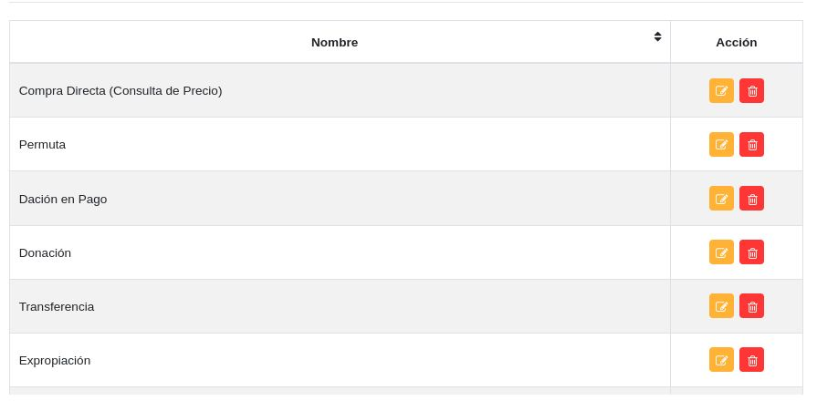

#Configuración Módulo de Bienes
*******************************

##Parámetros generales 

###Condiciones físicas

A través de esta funcionalidad se gestiona información sobre la condición física de los bienes institucionales.   

Crear condición física: 

- Dirigirse a la **Configuración** del módulo de **Bienes**.
- Ingresar a **Condiciones Físicas** en la sección **Parámetros Generales**.
- Completar el formulario ingresando el nombre de la condición física.   
- Presionar el botón **Guardar**  y verificar que se haya almacenado en la lista de registros. 

Figura: Condiciones Físicas

Gestión de registros: 

Para **Editar** o **Eliminar** un registro se debe hacer uso de los botones ubicados en la columna titulada **Acción** de la tabla de **Registros**.

  

###Estatus de uso 

A través de esta funcionalidad se gestiona información sobre el estatus de uso de los bienes institucionales.   

Crear estatus de uso: 

- Dirigirse a la **Configuración** del módulo de **Bienes**.
- Ingresar a **Estatus de uso** en la sección **Parámetros Generales**.
- Completar el formulario ingresando el nombre del estatus de uso.   
- Presionar el botón **Guardar**  y verificar que se haya almacenado en la lista de registros. 

Figura: Estatus de Uso

Gestión de registros: 

Para **Editar** o **Eliminar** un registro se debe hacer uso de los botones ubicados en la columna titulada **Acción** de la tabla de **Registros**.

    

###Funciones de uso 

A través de esta funcionalidad se gestiona información sobre las funciones de uso de los bienes institucionales.   

Crear función de uso: 

- Dirigirse a la **Configuración** del módulo de **Bienes**.
- Ingresar a **Condiciones Físicas** en la sección **Parámetros Generales**.
- Completar el formulario ingresando el nombre de la función de uso.   
- Presionar el botón **Guardar**  y verificar que se haya almacenado en la lista de registros. 

Figura: Funciones de Uso

Gestión de registros: 

Para **Editar** o **Eliminar** un registro se debe hacer uso de los botones ubicados en la columna titulada **Acción** de la tabla de **Registros**.

###Tipo de adquisición 

A través de esta funcionalidad se gestiona información sobre el tipo de adquisición de los bienes institucionales.   

Crear tipo de adquisición:  

- Dirigirse a la **Configuración** del módulo de **Bienes**.
- Ingresar a **Estatus de uso** en la sección **Parámetros Generales**.
- Completar el formulario ingresando el nombre del tipo de adquisición.   
- Presionar el botón **Guardar**  y verificar que se haya almacenado en la lista de registros. 
 

Figura: Tipo de Adquisición

Gestión de registros: 

Para **Editar** o **Eliminar** un registro se debe hacer uso de los botones ubicados en la columna titulada **Acción** de la tabla de **Registros**.

