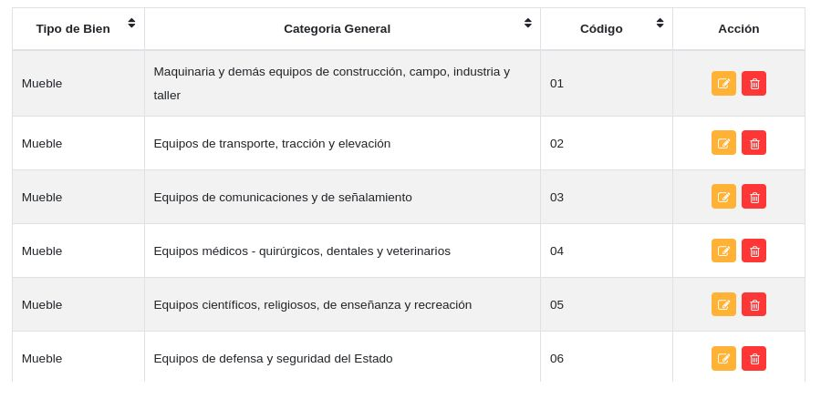
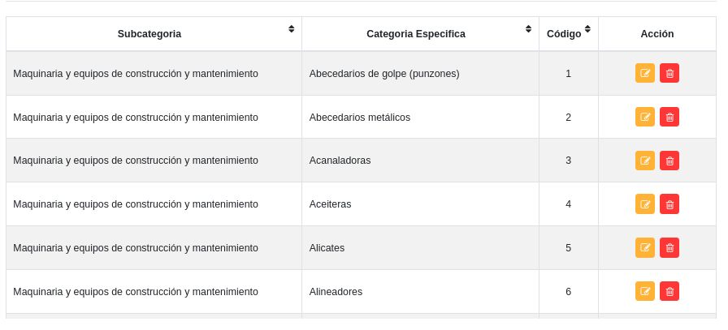

#Configuración Módulo de Bienes
*******************************

##Parámetros específicos del clasificador de bienes 

###Tipos de bienes

A través de esta funcionalidad se gestiona información sobre los tipos de bienes institucionales.   

Para registrar un tipo de bien: 

- Dirigirse a la **Configuración** del módulo de **Bienes**.
- Ingresar a **Tipos de Bienes** en la sección **Parámetros Específicos del Clasificador de Bienes**.
- Completar el formulario ingresando el nombre del tipo de bien.  
- Presionar el botón **Guardar**  y verificar que se haya almacenado en la lista de registros. 

Figura: Tipos de Bienes

Esta sección permite **Editar** o **Eliminar** cualquier registro, haciendo uso de los botones ubicados en la columna titulada **Acción** de la tabla de registros.  

###Categorías generales

A través de esta funcionalidad se gestiona información sobre las categorías generales de los bienes institucionales.   

Para registrar estatus de uso: 

- Dirigirse a la **Configuración** del módulo de **Bienes**.
- Ingresar a **Estatus de uso** en la sección **Parámetros Generales**.
- Completar el formulario ingresando el tipo de bien al que pertenece la categoría, código de la categoría general y el nombre de la categoría general.
- Presionar el botón **Guardar**  y verificar que se haya almacenado en la lista de registros. 

Figura: Categorías Generales

Esta sección permite **Editar** o **Eliminar** cualquier registro, haciendo uso de los botones ubicados en la columna titulada **Acción** de la tabla de registros.  

###Subcategorías

A través de esta funcionalidad se gestiona información sobre el tipo de adquisición de los bienes institucionales.   

Para registrar estatus de uso: 

- Dirigirse a la **Configuración** del módulo de **Bienes**.
- Ingresar a **Estatus de uso** en la sección **Parámetros Generales**.
- Completar el formulario ingresando el nombre del tipo de adquisición.   
- Presionar el botón **Guardar**  y verificar que se haya almacenado en la lista de registros. 

Figura: Subcategorías

Esta sección permite **Editar** o **Eliminar** cualquier registro, haciendo uso de los botones ubicados en la columna titulada **Acción** de la tabla de registros.  

###Categorías específicas
	
A través de esta funcionalidad se gestiona información sobre el tipo de adquisición de los bienes institucionales.   

Para registrar estatus de uso: 

- Dirigirse a la **Configuración** del módulo de **Bienes**.
- Ingresar a **Estatus de uso** en la sección **Parámetros Generales**.
- Completar el formulario ingresando el nombre del tipo de adquisición.   
- Presionar el botón **Guardar**  y verificar que se haya almacenado en la lista de registros. 

Figura: Categorías Específicas

Esta sección permite **Editar** o **Eliminar** cualquier registro, haciendo uso de los botones ubicados en la columna titulada **Acción** de la tabla de registros. 

