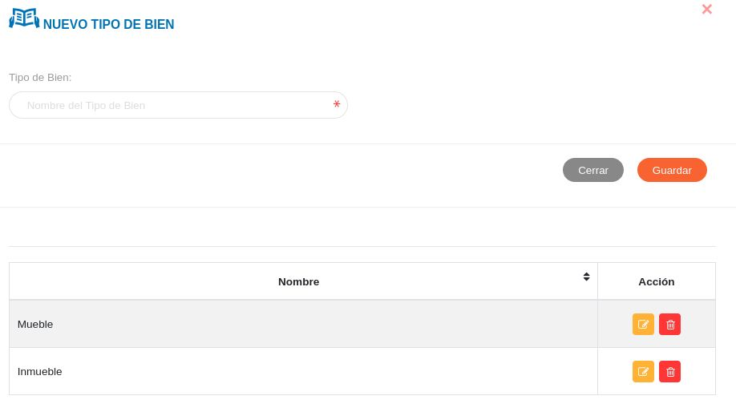
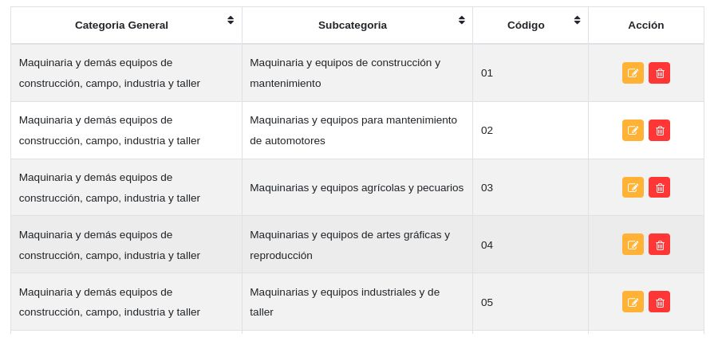

#Configuración Módulo de Bienes
*******************************

##Parámetros específicos del clasificador de bienes 

###Tipos de bienes

A través de esta funcionalidad se gestiona información sobre los tipos de bienes institucionales.   

Crear tipo de bien: 

- Dirigirse a la **Configuración** del módulo de **Bienes**.
- Ingresar a **Tipos de Bienes** en la sección **Parámetros Específicos del Clasificador de Bienes**.
- Completar el formulario ingresando el nombre del tipo de bien.  
- Presionar el botón **Guardar** y verificar que se haya almacenado en la lista de registros. 

Figura 19: Tipos de Bienes

Gestión de registros: 

Para **Editar** o **Eliminar** un registro se debe hacer uso de los botones ubicados en la columna titulada **Acción** de la tabla de **Registros**.

###Categorías generales

A través de esta funcionalidad se gestiona información sobre las categorías generales de los bienes institucionales.   

Crear categoría general:

- Dirigirse a la **Configuración** del módulo de **Bienes**.
- Ingresar a **Categorías Generales** en la sección **Parámetros Específicos del Clasificador de Bienes**.
- Completar el formulario ingresando el tipo de bien al que pertenece la categoría, código de la categoría general y el nombre de la categoría general.
- Presionar el botón **Guardar** y verificar que se haya almacenado en la lista de registros. 

Figura 20: Categorías Generales

Gestión de registros: 

Para **Editar** o **Eliminar** un registro se debe hacer uso de los botones ubicados en la columna titulada **Acción** de la tabla de **Registros**.

###Subcategorías

A través de esta funcionalidad se gestiona información sobre el tipo de adquisición de los bienes institucionales.   

Crear subcategoría: 

- Dirigirse a la **Configuración** del módulo de **Bienes**.
- Ingresar a **Subcategorías** en la sección **Parámetros Específicos del Clasificador de Bienes**.
- Completar el formulario.   
- Presionar el botón **Guardar** y verificar que se haya almacenado en la lista de registros. 

Figura 21: Subcategorías

Gestión de registros: 

Para **Editar** o **Eliminar** un registro se debe hacer uso de los botones ubicados en la columna titulada **Acción** de la tabla de **Registros**.

 

###Categorías específicas
	
A través de esta funcionalidad se gestiona información sobre el tipo de adquisición de los bienes institucionales.   

Crear categoría específica:  

- Dirigirse a la **Configuración** del módulo de **Bienes**.
- Ingresar a **Categorías Específicas** en la sección **Parámetros Específicos del Clasificador de Bienes**.
- Completar el formulario.   
- Presionar el botón **Guardar** y verificar que se haya almacenado en la lista de registros. 

Figura 22: Categorías Específicas

Gestión de registros: 

Para **Editar** o **Eliminar** un registro se debe hacer uso de los botones ubicados en la columna titulada **Acción** de la tabla de **Registros**.

 

