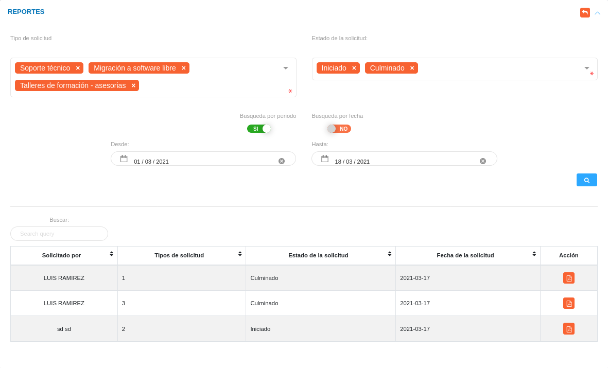

# Reportes del Módulo de Atención al Ciudadano 
**********************************************

##  Generar reportes 

Desde la sección de **Reportes** se generan informes sobre las solicitudes realizadas, esta sección incorpora una funcionalidad para filtrar todos los registros de solicitudes, a partir del tipo de solicitud y estado de la solicitud. Además, a través de los botones de selección es posible realizar la búsqueda por periodo o por una fecha específica.

!!! note "Nota"
    Los campos de selección **Tipo de solicitud** y **Estado de solicitud** permiten elegir varias opciones para filtrar los registros. 

Figura 6: Reportes
  

Para generar un reporte:

-   Dirigirse al **Módulo de Oficina de Atención al Ciudadano** e ingresar en la opción **Reportes**.
-   Seleccione la opción de búsqueda en los campos de selección **Tipo de solicitud** y **Estado de solicitud**.
-   Seleccione a través de los botones de selección una búsqueda por periodo o por una fecha específica.
-   Presione el botón **Buscar**  para filtrar los registros.
-   Para generar un reporte de cualquiera de los registros, presione el botón **Generar reporte**  ubicado en la columna titulada **Acción**. 

   