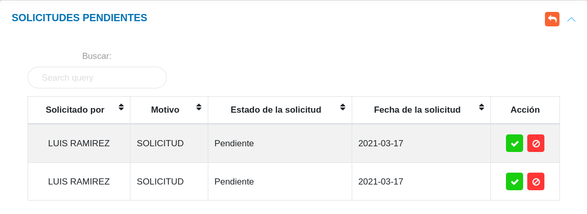
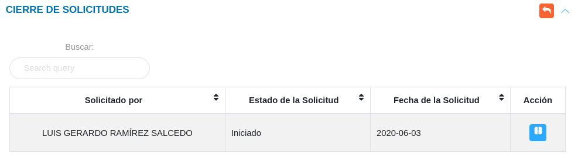

# Gestión de Solicitudes 
************************

## Solicitudes 

En esta sección se listan todos los registros de solicitudes realizadas y permite formular una nueva solicitud.  Desde la tabla de registros se puede gestionar la información sobre la solicitud haciendo uso de los botones ubicados en la columna titulada **Acción** que permiten: ver información detallada, editar o eliminar el registro.

Figura 1: Solicitudes
  

### Crear una nueva solicitud 

- Dirigirse al **Módulo de Oficina de Atención al Ciudadano** e ingresar en **Solicitudes**.
- Ubicarse en la sección **Solicitudes**.
- Presionar el botón **Crear**  ubicado en la esquina superior derecha de esta sección.
- Completar el formulario de la solicitud.
- Presionar el botón **Guardar**  y verificar que se muestre en la tabla de registros en la sección de **Solicitudes**

### Datos del formulario

En el formulario de la solicitud se incluyen los datos asociados al solicitante, para añadir **números telefónicos** presione el botón **Agregar** para los diferentes números de contacto.

!!! info ""

	 

Figura 2: Formulario de solicitud
  

### Gestión de registros

Para **Ver información detallada**, **Editar** o **Eliminar** un registro se debe hacer uso de los botones ubicados en la columna titulada **Acción** de la tabla de registros en la sección de **Solicitudes**.

## Solicitudes Pendientes

Una vez se genera una nueva solicitud, además de añadirse a la tabla **Solicitudes**, el registro se almacena en la tabla de **Solicitudes Pendientes**, desde esta sección se gestiona la aprobación o rechazo de solicitud.

Figura 3: Solicitudes Pendientes
  

Para **aprobar** o **rechazar** una solicitud el jefe de oficina de atención al ciudadano o usuario con permisos especiales, hace uso de los botones ubicados en la columna titulada **Acción** de la tabla de **Solicitudes Pendientes**.

Una vez es aprobada una solicitud, el registro cambia su estado de **Pendiente** a **Iniciado**.

## Cierre de solicitudes

Una vez la solicitud ha sido aprobada, este registro cambia su estado como **Iniciado**. Luego de que la solicitud ha sido atendida, desde la sección **Cierre de Solicitud** se culmina el proceso haciendo uso del botón **Cerrar** ubicado en la columna titulada **Acción** de esta tabla de registros. 

Figura 4: Cierre de Solicitudes
  

Una vez se inicia el cierre de solicitud se muestra una ventana emergente, en la que el jefe de oficina de atención al ciudadano o usuario con permisos especiales debe realizar las siguientes acciones:

-	Indicar la fecha de verificación.
-	Subir uno o varios archivos asociados a la solicitud.
-	Guardar el registro para dar cierre a la solicitud. 

!!! warning "Advertencia"
	Los formatos permitidos para la carga de archivos son **.doc**, **.docx**, **.odt**, **.pdf**, **.png**, **.jpeg** y **.jpg**

Figura 5: Cierre de Solicitud
  

Una vez la solicitud ha sido ejecutada y se completa el cierra de solicitud, el registro cambia su estado de **Iniciado** a **Culminado**.

   