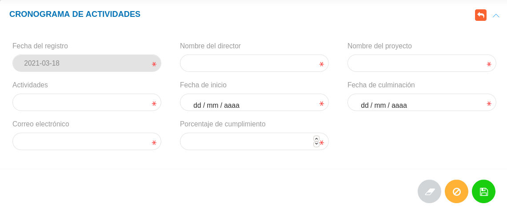

# Cronograma de actividades  
***************************

## Cronograma de actividades 

En la sección **Cronograma** se listan todas las actividades asignadas que han sido formuladas desde el módulo de oficina de atención al ciudadano (OAC). La tabla de registros incluye información detallada sobre la asignación de actividades como el nombre del director, fecha de asignación, nombre del proyecto, actividades y la dirección de correo electrónico del responsable. 

Figura 7: Cronograma

### Crear un nuevo registro

- Dirigirse al **Módulo de Oficina de Atención al Ciudadano**, luego a **Cronograma de Actividades** y ubicarse en la sección **Cronograma**.
- Haciendo uso del botón **Crear**  ubicado en la esquina superior derecha de esta sección, se procede a realizar un nuevo registro.
- Completar el formulario de la sección **Cronograma de actividades**.
- Presionar el botón **Guardar**  y verificar el registro en la sección **Cronograma**.

Figura 8: Formulario de Cronograma de Actividades

### Gestión de registros

Para **Ver información detallada**, **Editar** o **Eliminar** un registro se debe hacer uso de los botones ubicados en la columna titulada **Acción** de la tabla de registros en la sección de **Cronograma**.

   