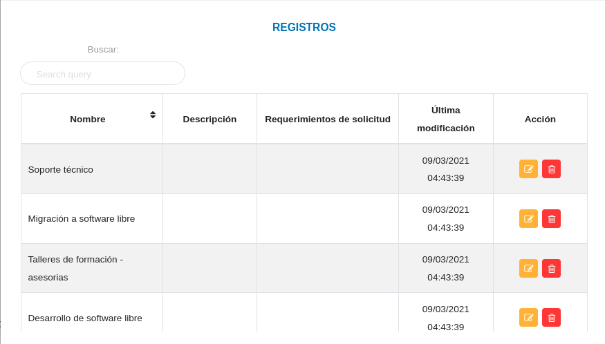

# Configuración Módulo de Oficina de Atención al Ciudadano
*************************************************************

## Registros comunes

A través de esta sección se lleva a cabo la gestión de los datos comunes a utilizar en las demás secciones del módulo. 

### Tipo de solicitud

Desde esta sección se registran los tipos de solicitudes según los servicios que ofrece la organización. 

#### Registrar tipo de solicitud

- Dirigirse a la **Configuración** del módulo de **Oficina de Atención al Ciudadano**.
- Ingresar a **Tipo de Solicitud** en la sección **Registros Comunes**.
- Completar el formulario ingresando el nombre, la descripción y requerimientos de la solicitud.
- Presionar el botón **Guardar** y verificar que se haya almacenado.

Figura 9: Tipo de Solicitud
  

#### Gestión de registros

Para **Editar** o **Eliminar** un registro se debe hacer uso de los botones ubicados en la columna titulada Acción de la tabla de Registros.

### Departamentos

Desde esta sección se registran los departamentos o las diferentes direcciones en la que se distribuye la organización.  

#### Registrar un departamento

- Dirigirse a la **Configuración** del módulo de **Oficina de Atención al Ciudadano**.
- Ingresar a **Departamentos** en la sección **Registros Comunes**.
- Completar el formulario ingresando el nombre y descripción del departamento.
- Presionar el botón **Guardar** y verificar que se haya almacenado.

Figura 10: Tipo de Solicitud
  

#### Gestión de registros

Para **Editar** o **Eliminar** un registro se debe hacer uso de los botones ubicados en la columna titulada Acción de la tabla de Registros.
  

