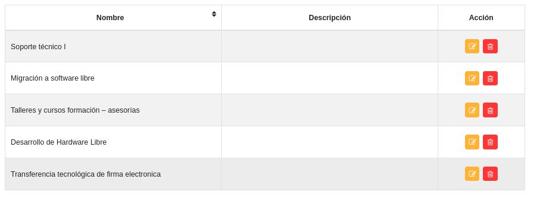
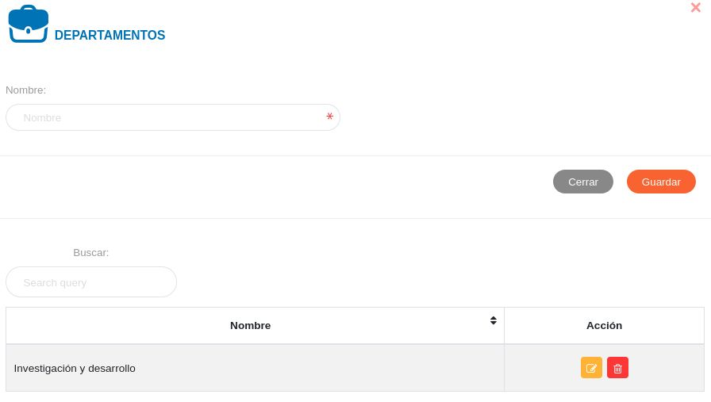

#Panel de Control Módulo de Oficina de Atención al Ciudadano
************************************************************

##Tipo de solicitud

Desde esta sección se registran los tipos de solicitudes según los servicios que ofrece la institución. 

Para registrar un tipo de solicitud:

- Dirigirse a la **Configuración** del módulo de **Oficina de Atención al Ciudadano**
- Ingresar a **Tipo de Solicitud** en la sección **Registros Comúnes**
- Completar el formulario ingresando el nombre y la descripción de la solicitud
- Presionar el botón **Guardar** y verificar que se haya almacenado

Figura: Tipo de Solicitud
  

Esta sección permite **Editar** o **Eliminar** cualquier registro, haciendo uso de los botones ubicados en la columna titulada **Acción** de la tabla de registros.  

##Departamentos

Desde esta sección se registran los departamentos o las diferentes direcciones en la que se organiza la institución.  

Para registrar un departamento:

- Dirigirse a la **Configuración** del módulo de **Oficina de Atención al Ciudadano**
- Ingresar a **Departamentos** en la sección **Registros Comúnes**
- Completar el formulario ingresando el nombre del departamento
- Presionar el botón **Guardar** y verificar que se haya almacenado

Figura: Departamentos
  

Esta sección permite **Editar** o **Eliminar** cualquier registro, haciendo uso de los botones ubicados en la columna titulada **Acción** de la tabla de registros.  

