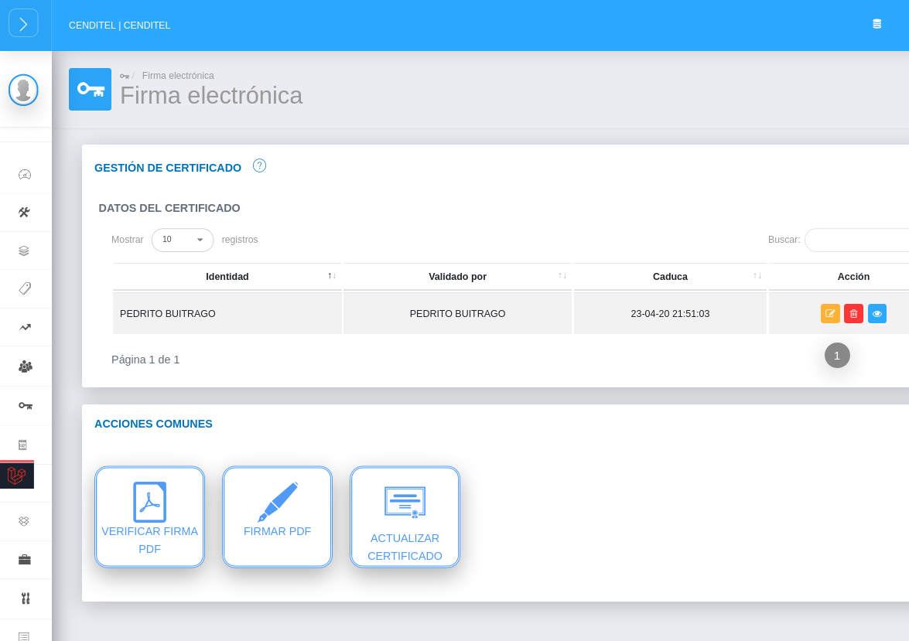
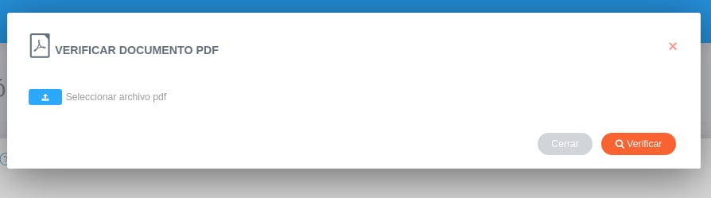

# Gestión de Firma Electrónica 
******************************

## Módulo de firma electrónica

Este módulo permite realizar tareas de gestión de firma electrónica, tales como el manejo de certificados electrónicos, la firma de documentos PDF y la verificación de firma en documentos PDF. El módulo de Firma Electrónica está integrado por dos secciones: **Gestión de Certificado** y **Acciones Comunes**.

-   Para entrar en el módulo de Firma Electrónica, ubicarse en el **Panel de Lateral de KAVAC**, presionar el botón **Firma Electrónica** y luego en **Gestión y firmado**.

Figura 1: Menú de Acceso al Módulo de Firma Electrónica
 

## Gestión de certificado

Esta sección contiene las opciones que permiten **Cargar**, **Actualizar**, **Eliminar** y **Ver información** sobre los certificados .p12 cargados en el sistema.

Figura 2: Panel de Firma Electrónica
 

### Cargar certificado

-   Presionar el botón **Cargar Certificado** ubicado en la sección **Acciones Comunes**. 
-   Presionar **Examinar** y buscar el certificado .p12 en el equipo.
-   Escribir la contraseña del certificado .p12.
-   Presionar **Guardar** .

Figura 3: Cargar Certificado

Una vez que se ha cargado un certificado .p12 en el sistema, la pantalla muestra los datos del certificado y ofrece la posibilidad de **Actualizar**, **Eliminar** y **Ver información** del certificado.

Figura 3: Panel de Firma Electrónica con certificado cargado

### Actualizar certificado

Al usar el botón Actualizar, se muestra una ventana emergente que permite cargar un nuevo certificado .p12.

-   Presionar el botón **Examinar** y buscar el certificado en el equipo.
-   Transcribir la contraseña del certificado y presionar **Subir certificado**.

Figura 3: Actualizar Certificado

### Eliminar certificado

Al usar el botón **Eliminar**, aparece un cuadro para eliminar el certificado .p12. 

-   Si se desea eliminar el certificado, presionar el botón **Confirmar**. De lo contrario, presionar **Cerrar**.

Figura 3: Eliminar Certificado

### Ver más información

Al usar el botón **Ver más información**, aparece un cuadro que muestra datos relevantes del certificado .p12. Para salir de este cuadro, presionar **Cerrar**. 

Figura 3: Detalles del Certificado

## Acciones comunes

### Verificar Documento PDF

La función de **Verificar Documento PDF** permite examinar la validez del certificado de un documento firmado electrónicamente.

-   Presionar el botón **Verificar Firma PDF**.
-   Buscar en el equipo el archivo PDF que se desea examinar.
-   Presionar **Verificar**. 

Figura 3: Verificar Documento PDF

Una vez seleccionado el certificado, la ventana se actualiza con datos que validan la autenticidad de la firma electrónica en el documento PDF.

Figura 9: Detalles de la Firma

### Firmar Documento PDF

La función de **Firmar PDF** permite integrar el certificado .p12 en un documento PDF para establecer la validez del mismo. 

-   Presionar el botón **Firmar**.
-   Buscar en el equipo el archivo PDF que se desea firmar.
-   Presionar **Firmar**. 

Figura 10: Firmar documento PDF

Una vez firmado el documento, la ventana se actualiza con datos que confirman el proceso de firma y un enlace para descargar el documento firmado electrónicamente. 

Figura 10: Detalles de la firma

### Actualizar certificado

Al usar el botón **Actualizar certificado**, aparece un cuadro que permite cargar un nuevo certificado .p12. El procedimiento es el mismo que en la sección **Gestión de Certificado**.

-   Presionar el botón **Examinar** y buscar el certificado en el equipo.
-   Transcribir la contraseña del certificado y presionar Subir certificado.

