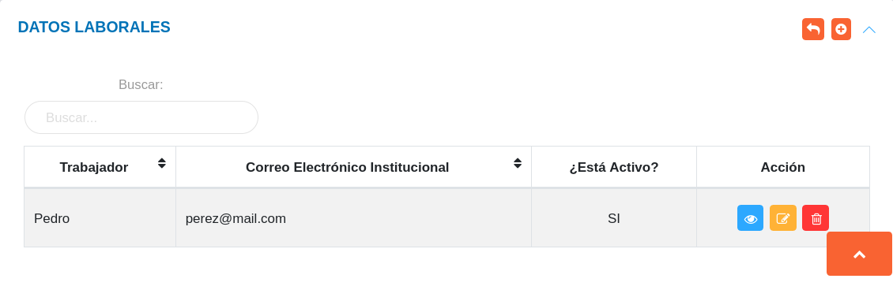
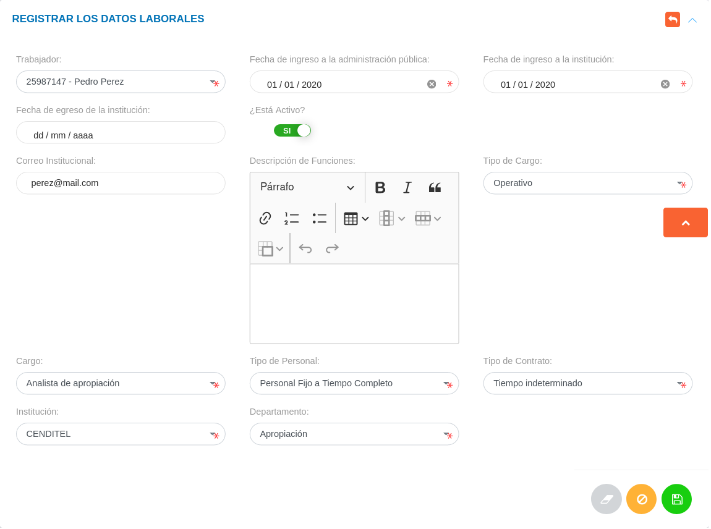

# Gestión de Datos Laborales
****************************

## Datos laborales

En esta sección se listan registros de datos laborales de los usuarios asociados al expediente de la organización y se muestra información asociada a cada registro como: nombre del trabajador, correo electrónico institucional y estatus laboral (¿está activo?).   Desde esta sección es posible realizar un nuevo registro de datos laborales de usuarios registrados previamente en la sección de datos personales.

Figura: Datos Laborales
 

A través de los botones ubicados en la columna titulada **Acción** el encargado de talento humano o usuario con permisos especiales puede: ver información del registro, editar el registro y eliminar registro.

### Registro de datos socioeconómicos

-   Dirigirse al módulo de **Talento Humano**, ingresar en **Expediente** y seleccionar la opción **Datos Laborales**.
-   Haciendo uso del botón **Crear**  ubicado en la esquina superior derecha de esta sección, se procede a realizar un nuevo registro de datos profesionales.
-   Completar el formulario de la sección **Registrar los Datos Laborales**.
-   Presionar el botón **Guardar**  para registrar los cambios una vez se complete el formulario.

!!! info "Nota"
    -  Los campos de selección **Tipo de Cargo**, **Cargo**, **Tipo de Personal** y **Tipo de Contrato** del formulario de la sección **Registrar los Datos Laborales**, corresponden a datos registrados previamente en la configuración del módulo. 
        
    

Figura: Registrar los Datos Laborales

### Gestión de registros 

Para **Ver información detallada**, **Editar** o **Eliminar** un registro se debe hacer uso de los botones ubicados en la columna titulada **Acción** de la tabla de registros en la sección de **Datos Laborales**.

