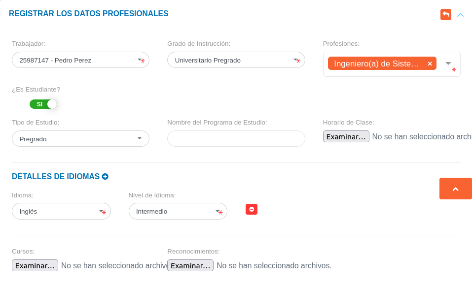

# Gestión de Datos Profesionales
********************************

## Datos profesionales

En esta sección se listan registros de datos profesionales de los usuarios asociados al expediente de la organización y se muestra información asociada a cada registro como: nombre del trabajador, grado de instrucción, profesión y estatus académico (¿es estudiante?). Desde esta sección es posible realizar un nuevo registro de datos profesionales de usuarios registrados previamente en la sección de datos personales.

Figura: Datos Profesionales
 

A través de los botones ubicados en la columna titulada **Acción** el encargado de talento humano o usuario con permisos especiales puede: ver información del registro, editar el registro y eliminar registro.

### Registro de datos profesionales

-   Dirigirse al módulo de **Talento Humano**, ingresar en **Expediente** y seleccionar la opción **Datos Profesionales**.
-   Haciendo uso del botón **Crear**  ubicado en la esquina superior derecha de esta sección, se procede a realizar un nuevo registro de datos profesionales.
-   Completar el formulario de la sección **Registrar los Datos Profesionales**.
-   Presionar el botón **Guardar**  para registrar los cambios una vez se complete el formulario.

!!! info "Nota"
    -   Los campos de selección **Grado de instrucción**, **Profesiones**, **Tipo de Estudio**, **Idiomas** y **Nivel de Idiomas** del formulario de la sección **Registrar los Datos Profesionales**, corresponden a datos registrados previamente en la configuración del módulo.
    -   El campo **Horario de clase** admite formatos de archivo **odt** y **pdf**.
    -   El campo **Cursos** admite formatos de archivo **odt**, **jpg**, **png** y **pdf**.
    -   El campo **Reconocimientos** admite formatos de archivo **odt**, **jpg**, **png** y **pdf**.

Figura: Registrar los Datos Personales

### Gestión de registros 

Para **Ver información detallada**, **Editar** o **Eliminar** un registro se debe hacer uso de los botones ubicados en la columna titulada **Acción** de la tabla de registros en la sección de **Datos Profesionales**.

   