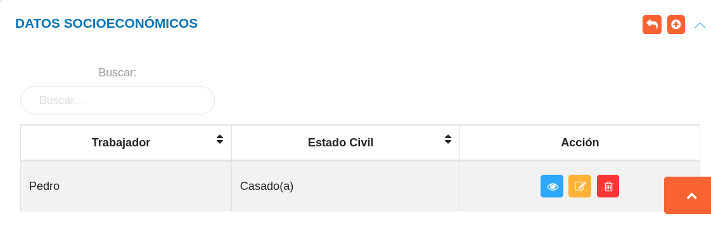

# Gestión de Datos Socioeconómicos
**********************************

## Datos socioeconómicos

En esta sección se listan registros de datos socioeconómicos de los usuarios asociados al expediente de la organización y se muestra información asociada a cada registro como: nombre del trabajador y estado civil.   Desde esta sección es posible realizar un nuevo registro de datos socioeconómicos de usuarios registrados previamente en la sección de datos personales.

Figura: Datos Socioeconómicos
 

A través de los botones ubicados en la columna titulada **Acción** el encargado de talento humano o usuario con permisos especiales puede: ver información del registro, editar el registro y eliminar registro.

### Registro de datos socioeconómicos

-   Dirigirse al módulo de **Talento Humano**, ingresar en **Expediente** y seleccionar la opción **Datos Socioeconómicos**.
-   Haciendo uso del botón **Crear**  ubicado en la esquina superior derecha de esta sección, se procede a realizar un nuevo registro de datos profesionales.
-   Completar el formulario de la sección **Registrar los Datos Socioeconómicos**.
-   Presionar el botón **Guardar**  para registrar los cambios una vez se complete el formulario.

!!! info "Nota"
    -   A través del bóton **Añadir** , ubicado en el apartado **Hijos del Trabajador** se realiza el registro de cada hijo del trabajador.
        
    

Figura: Registrar los Datos Socioeconómicos

### Gestión de registros 

Para **Ver información detallada**, **Editar** o **Eliminar** un registro se debe hacer uso de los botones ubicados en la columna titulada **Acción** de la tabla de registros en la sección de **Datos Socioeconómicos**.

   