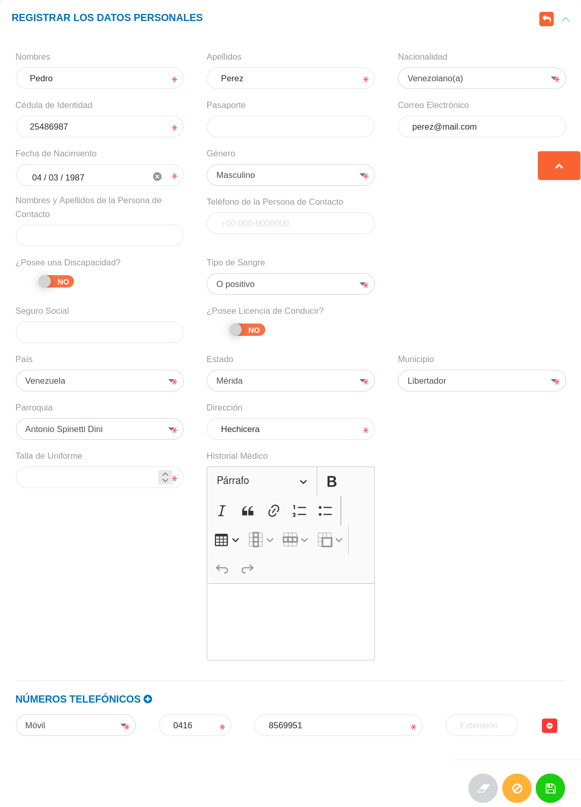

# Gestión de Datos Personales
*****************************

## Datos personales

En esta sección se listan registros de datos personales de los usuarios asociados al expediente de la organización y se muestra información asociada a cada registro como: nombres, apellidos, cédula de identidad y correo electrónico. Desde esta sección es posible realizar un nuevo registro de datos personales de usuario.

Figura: Datos Personales
 

A través de los botones ubicados en la columna titulada **Acción** el encargado de talento humano o usuario con permisos especiales puede: ver información del registro, editar el registro y eliminar registro.

### Registro de datos personales

-   Dirigirse al módulo de **Talento Humano**, ingresar en **Expediente** y seleccionar la opción **Datos Personales**.
-   Haciendo uso del botón **Crear**  ubicado en la esquina superior derecha de esta sección, se procede a realizar un nuevo registro de datos personales.
-   Completar el formulario de la sección **Registrar los Datos Personales**.
-   Presionar el botón **Guardar**  para registrar los cambios una vez se complete el formulario.

!!! info "Nota"
    -   Los campos de selección **Género**, **Discapacidad**, **Tipo de Sangre** y **Grado de Licencia de Conducir** del formulario de la sección **Registrar los Datos Personales**, corresponden a datos registrados previamente en la configuración del módulo.
    

Figura: Registrar los Datos Personales

### Gestión de registros 

Para **Ver información detallada**, **Editar** o **Eliminar** un registro se debe hacer uso de los botones ubicados en la columna titulada **Acción** de la tabla de registros en la sección de **Datos Personales**.

   