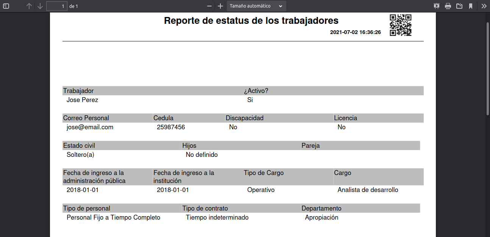

# Gestión de Reportes Detallados de Trabajadores
************************************************

## Estatus del trabajador

Esta sección permite generar un informe con información detallada sobre cada trabajador que ha sido registrado a través de la sección **Expediente** del módulo de **Talento Humano**.  

### Generar reporte detallado de un trabajador 

-   Dirigirse al módulo de **Talento Humano**, ingresar en **Reportes** y seleccionar la opción **Reporte detallado de trabajadores**.
-   Filtrar la información a través del campo de selección **Trabajador** que permite elegir un empleado asociado.  
-   Presionar el botón **Buscar**  para filtrar los registros.
-   Presionar el botón **generar reporte**  ubicado en la columna titulada **Acción**, según el registro que se desea consultar. 

Figura: Estatus del Trabajador
 

Figura: Reporte Detallado del Trabajador
 

!!! note "Nota"
    De igual forma es posible consultar información sobre un empleado haciendo uso del botón **ver registro** ubicado en la columna titulada **Acción** de la tabla de registros.
    
    

Figura: Ver Información Detallada del Trabajador
 
