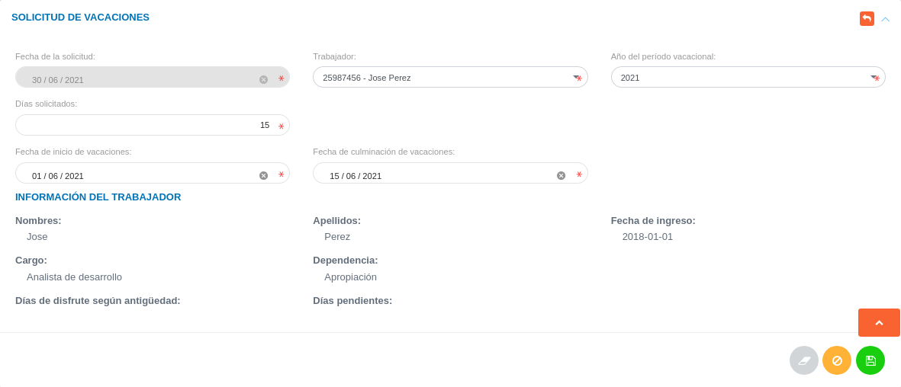
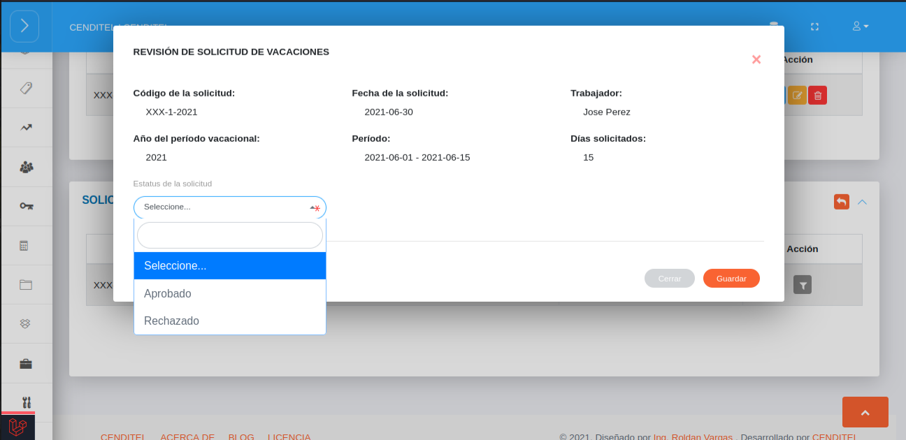

# Gestión de Solicitudes de Vacaciones
**************************************

## Solicitudes de vacaciones

A través de la sección **Solicitudes de Vacaciones** se lleva a cabo la gestión de vacaciones del personal de la organización.  En esta sección se listan las solicitudes de permisos que han sido formuladas, de igual forma es posible generar una nueva solicitud de vacaciones, consultar, editar o eliminar cualquier registro.  

Figura: Solicitudes de Vacaciones

### Crear una nueva solicitud de vacaciones

-   Dirigirse al módulo de **Talento Humano**, ingresar en la opción **Solicitudes** y seleccionar **Solicitud de vacaciones**.
-   Ubicarse en la sección **Solicitudes de Vacaciones** y presionar el botón **Crear**  ubicado en la esquina superior derecha de esta sección para realizar una nueva solicitud.
-   Completar el formulario de la sección **Solicitud de Vacaciones**.
-   Presionar el botón **Guardar**  para registrar los cambios una vez se complete el formulario.

!!! info "Nota"
    Para realizar una solicitud de vacaciones el trabajador debe tener al menos un (1) año cumplido laborando en la organización. 

Figura: Formulario Solicitud de Vacaciones

### Gestión de registros

Para **Ver información detallada**, **Editar** o **Eliminar** un registro se debe hacer uso de los botones ubicados en la columna titulada **Acción** de la tabla de registros en la sección de **Solicitudes de Vacaciones**.

## Solicitudes de vacaciones pendientes

Una vez se genera una nueva solicitud, además de añadirse a la tabla **Solicitudes de Vacaciones**, el registro se almacena en la tabla de **Solicitudes de Vacaciones Pendientes**, desde esta sección se gestiona la aprobación o rechazo de solicitud.

Figura: Solicitudes de Vacaciones Pendientes

### Aprobar o rechazar solicitud

Para **aprobar** o **rechazar** una solicitud el usuario encargado de talento humano o usuario con permisos especiales, hace uso del botón **revisar solicitud** ubicado en la columna titulada **Acción** de la tabla de **Solicitudes de Vacaciones Pendientes**.

!!! info "Botón revisar solicitud"
    

A continuación se muestra una ventana emergente con información asociada al registro y un botón de selección que permite ajustar el **Estatus de la solicitud** (aprobar o rechazar), luego de realizar la revisión correspondiente y seleccionar la opción de estatus, se registran los cambios presionando el botón **Guardar** ubicado en la parte inferior derecha de la ventana emergente.   

Figura: Revisión de Solicitud de Adelanto de Prestaciones 

El trabajador es notificado sobre la fecha de aprobación en el caso de ser aprobada o motivo de rechazo en el caso de ser rechazada.