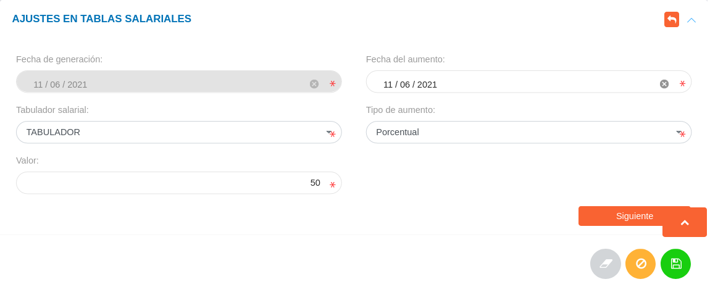
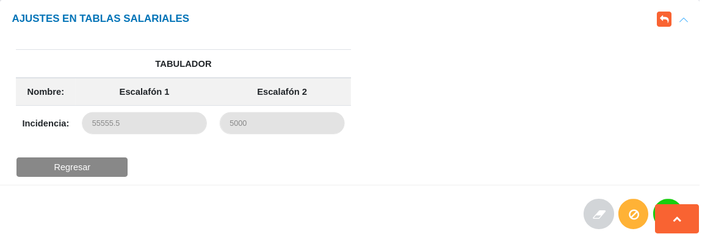

# Gestión de Tablas Salariales
******************************

## Ajustes en tablas salariales

Desde esta sección es posible establecer un aumento sobre las tablas salariales.  Cabe destacar que es necesario contar con un **Tabulador** registrado previamente en la configuración del módulo para ajustar las incidencias sobre los diferentes escalafones salariales.

Crear ajuste en tabla salarial

-	Dirigirse al módulo de **Talento Humano** e ingresar en **Ajustes en Tablas Salariales**.
-	Completar el formulario de la sección **Ajustes en Tablas Salariales**.
-	Presionar el botón **Siguiente** para avanzar al siguiente formulario y verificar las incidencias sobre los escalafones salariales asociados al **Tabulador**.
-	Una vez se complete el formulario se registran los ajustes presionando el botón **Guardar** .   

!!! info "Nota"
	-	La fecha de generación es establecida de forma automatica por el sistema, por lo que no es posible modificarla.
	-	Los tabuladores salariales corresponden a registros previos realizados en la configuración del módulo.
	-	Los aumentos salariales pueden ser expresados en porcentaje o valor absoluto, restringiendo el campo a un valor númerico. De igual forma, puede ser de tipo **Diferente** permitiendo al usuario especificar valores númericos con incidencias sobre cada escalafón salarial. 

Figura: Ajustes en Tablas Salariales

Figura: Ajustes Porcentual/Valor absoluto en Tablas Salariales

Figura: Ajustes en Tablas Salariales (tipo de aumento diferente)
 

   