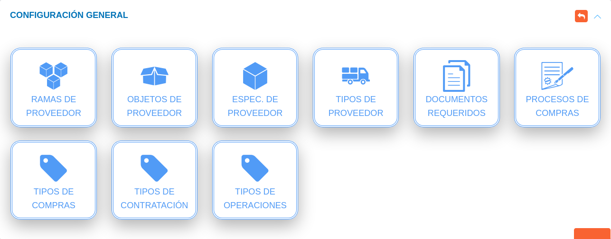
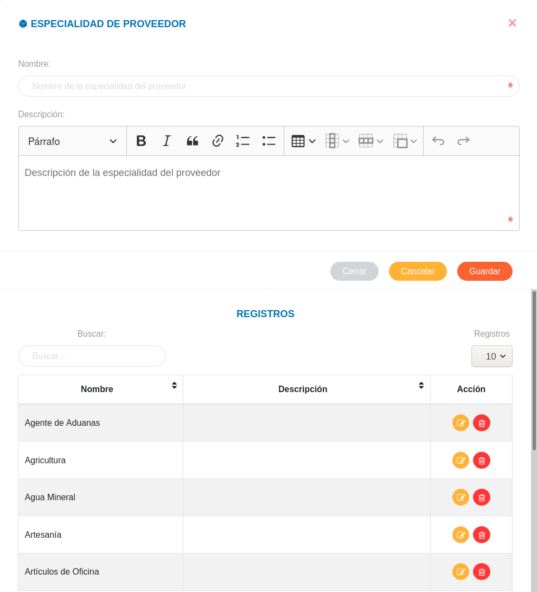
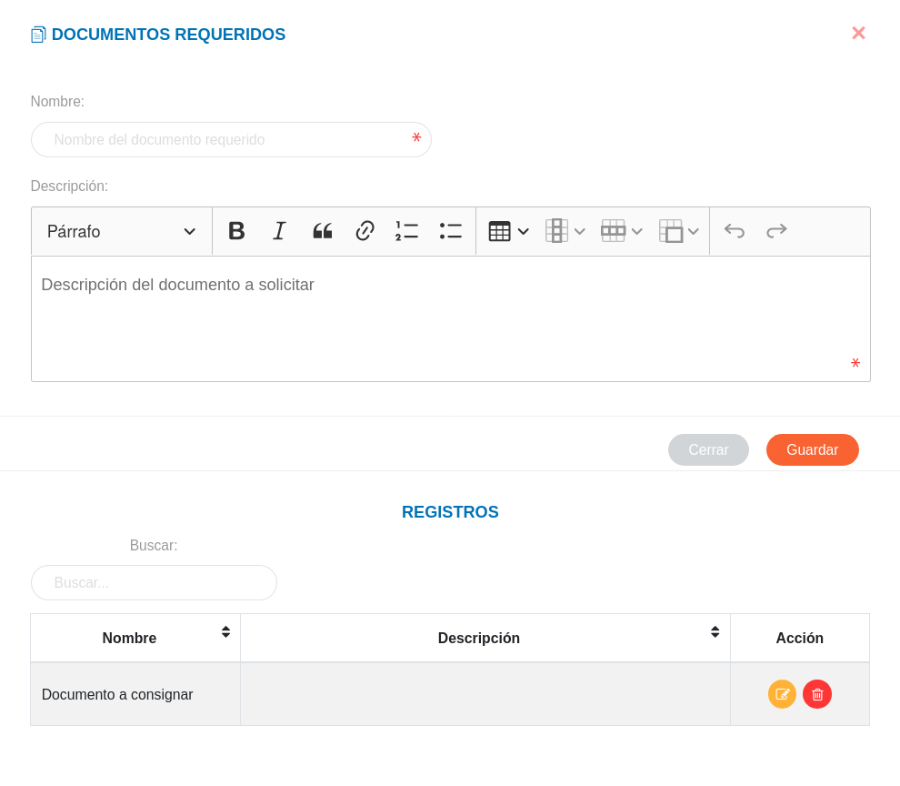

# Configuración Módulo de Compras
*********************************

## Configuración general

### Rama de Proveedor

A través de esta funcionalidad se gestiona información sobre las diferentes ramas a las que un proveedor puede estar asociado.  Los registros realizados en esta sección corresponden a datos a incluir en la información básica de un proveedor en la gestión de proveedores del módulo de compras.   

Crear rama de proveedor: 

- Dirigirse a la **Configuración** del módulo de **Compras**.
- Ingresar a **Ramas de Proveedor** en la sección **Configuración General**.
- Completar el formulario de la sección **Rama de Proveedor**.   
- Presionar el botón **Guardar** y verificar que se haya almacenado en la lista de registros. 

Figura:  Rama de Proveedor

Gestión de registros: 

Para **Editar** o **Eliminar** un registro se debe hacer uso de los botones ubicados en la columna titulada **Acción** de la tabla de **Registros**.

  

### Objetos de Proveedor

A través de esta funcionalidad se gestiona información sobre los diferentes objetos asociados al servicio que presta un proveedor.  Los registros realizados en esta sección corresponden a datos a incluir en la información básica de los proveedores.   

Crear objeto de proveedor: 

- Dirigirse a la **Configuración** del módulo de **Compras**.
- Ingresar a **Objetos de Proveedor** en la sección **Configuración General**.
- Completar el formulario **Objeto de Proveedor**.   
- Presionar el botón **Guardar** y verificar que se haya almacenado en la lista de registros. 

Figura:  Objeto de Proveedor

Gestión de registros: 

Para **Editar** o **Eliminar** un registro se debe hacer uso de los botones ubicados en la columna titulada **Acción** de la tabla de **Registros**.

  

### Especialidad de Proveedor

A través de esta funcionalidad se gestiona información sobre las diferentes especialidades a las que un proveedor puede estar asociado.  Los registros realizados en esta sección corresponden a datos a incluir en la información básica de un proveedor en la gestión de proveedores del módulo de compras.   

Crear especialidad de proveedor: 

- Dirigirse a la **Configuración** del módulo de **Compras**.
- Ingresar a **Especialidad de Proveedor** en la sección **Configuración General**.
- Completar el formulario de la sección **Especialidad de Proveedor**.   
- Presionar el botón **Guardar** y verificar que se haya almacenado en la lista de registros. 

Figura:  Especialidad de Proveedor

Gestión de registros: 

Para **Editar** o **Eliminar** un registro se debe hacer uso de los botones ubicados en la columna titulada **Acción** de la tabla de **Registros**.

  

### Tipos de Proveedor

A través de esta funcionalidad se gestiona información sobre los diferentes tipos de proveedores a gestionar.  Los registros realizados en esta sección corresponden a datos a incluir en la información básica de un proveedor en la gestión de proveedores del módulo de compras.   

Crear tipo de proveedor: 

- Dirigirse a la **Configuración** del módulo de **Compras**.
- Ingresar a **Tipos de Proveedor** en la sección **Configuración General**.
- Completar el formulario de la sección **Especialidad de Proveedor**.   
- Presionar el botón **Guardar** y verificar que se haya almacenado en la lista de registros. 

Figura: Tipo de Proveedor

Gestión de registros: 

Para **Editar** o **Eliminar** un registro se debe hacer uso de los botones ubicados en la columna titulada **Acción** de la tabla de **Registros**.

  

### Documentos Requeridos

A través de esta funcionalidad se gestionan los tipos de documentos a consignar o solicitar para registro de proveedores.  Los registros realizados en esta sección corresponden a campos habilitados en el formulario de registro en la gestión de proveedores del módulo de compras.   

Crear documento requerido: 

- Dirigirse a la **Configuración** del módulo de **Compras**.
- Ingresar a **Documentos Requeridos** en la sección **Configuración General**.
- Completar el formulario de la sección **Documentos Requeridos**.   
- Presionar el botón **Guardar** y verificar que se haya almacenado en la lista de registros. 

Figura: Documentos Requeridos

Gestión de registros: 

Para **Editar** o **Eliminar** un registro se debe hacer uso de los botones ubicados en la columna titulada **Acción** de la tabla de **Registros**.

  

### Documentos Requeridos

A través de esta funcionalidad se gestionan los tipos de documentos a consignar o solicitar para registro de proveedores.  Los registros realizados en esta sección corresponden a campos habilitados en el formulario de registro en la gestión de proveedores del módulo de compras.   

Crear documento requerido: 

- Dirigirse a la **Configuración** del módulo de **Compras**.
- Ingresar a **Documentos Requeridos** en la sección **Configuración General**.
- Completar el formulario de la sección **Documentos Requeridos**.   
- Presionar el botón **Guardar** y verificar que se haya almacenado en la lista de registros. 

Figura: Documentos Requeridos

Gestión de registros: 

Para **Editar** o **Eliminar** un registro se debe hacer uso de los botones ubicados en la columna titulada **Acción** de la tabla de **Registros**.

  

### Documentos Requeridos

A través de esta funcionalidad se gestionan los tipos de documentos a consignar o solicitar para registro de proveedores.  Los registros realizados en esta sección corresponden a campos habilitados en el formulario de registro en la gestión de proveedores del módulo de compras.   

Crear documento requerido: 

- Dirigirse a la **Configuración** del módulo de **Compras**.
- Ingresar a **Documentos Requeridos** en la sección **Configuración General**.
- Completar el formulario de la sección **Documentos Requeridos**.   
- Presionar el botón **Guardar** y verificar que se haya almacenado en la lista de registros. 

Figura: Documentos Requeridos

Gestión de registros: 

Para **Editar** o **Eliminar** un registro se debe hacer uso de los botones ubicados en la columna titulada **Acción** de la tabla de **Registros**.

  
