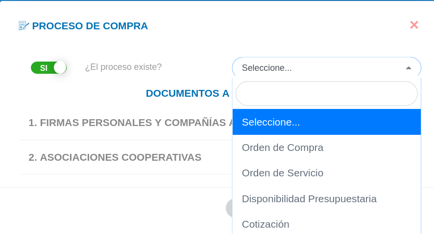
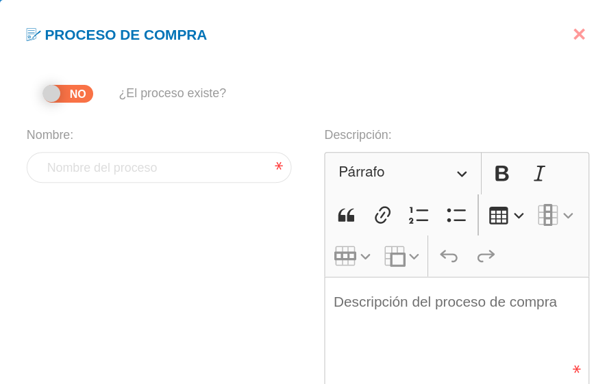
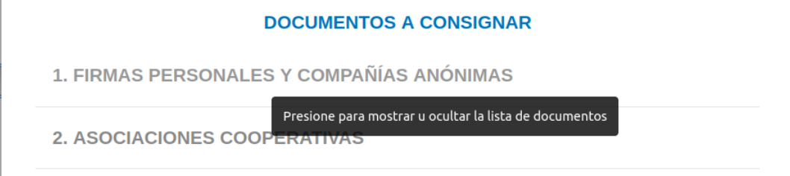
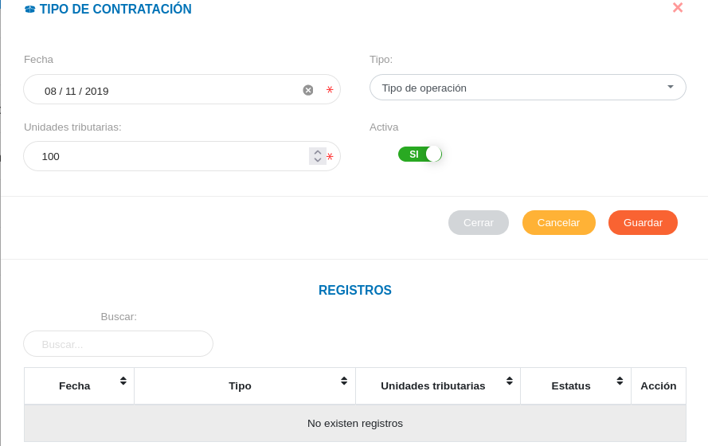
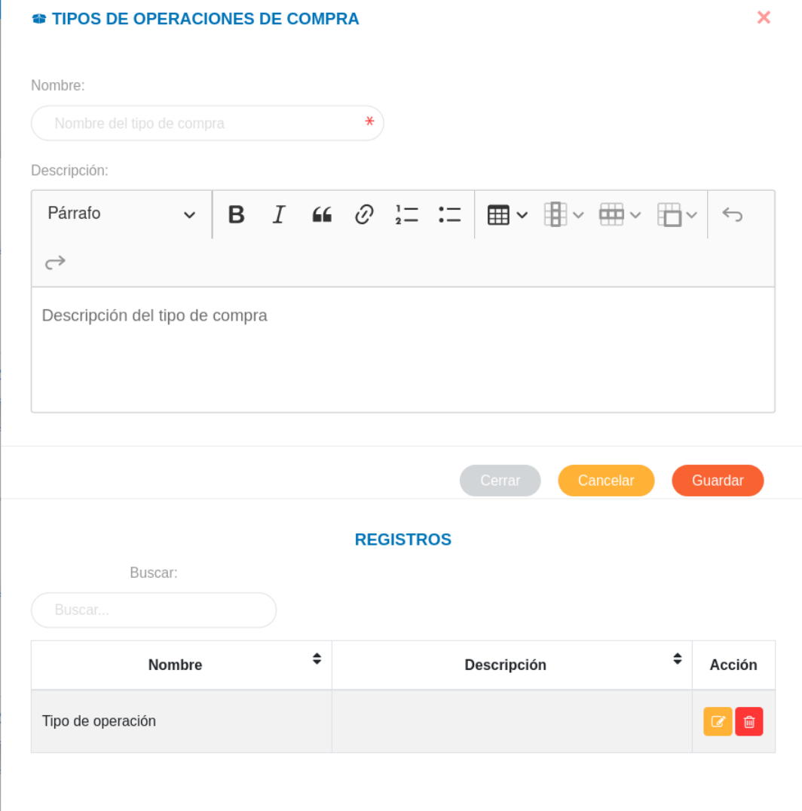

# Configuración Módulo de Compras
*********************************

## Configuración general

### Rama de Proveedor

A través de esta funcionalidad se gestiona información sobre las diferentes ramas a las que un proveedor puede estar asociado.  Los registros realizados en esta sección corresponden a datos a incluir en la información básica de un proveedor en la gestión de proveedores del módulo de compras.   

Crear rama de proveedor: 

- Dirigirse a la **Configuración** del módulo de **Compras**.
- Ingresar a **Ramas de Proveedor** en la sección **Configuración General**.
- Completar el formulario de la sección **Rama de Proveedor**.   
- Presionar el botón **Guardar** y verificar que se haya almacenado en la lista de registros. 

Figura:  Rama de Proveedor

Gestión de registros: 

Para **Editar** o **Eliminar** un registro se debe hacer uso de los botones ubicados en la columna titulada **Acción** de la tabla de **Registros**.

  

### Objetos de Proveedor

A través de esta funcionalidad se gestiona información sobre los diferentes objetos asociados al servicio que presta un proveedor.  Los registros realizados en esta sección corresponden a datos a incluir en la información básica de los proveedores.   

Crear objeto de proveedor: 

- Dirigirse a la **Configuración** del módulo de **Compras**.
- Ingresar a **Objetos de Proveedor** en la sección **Configuración General**.
- Completar el formulario **Objeto de Proveedor**.   
- Presionar el botón **Guardar** y verificar que se haya almacenado en la lista de registros. 

Figura:  Objeto de Proveedor

Gestión de registros: 

Para **Editar** o **Eliminar** un registro se debe hacer uso de los botones ubicados en la columna titulada **Acción** de la tabla de **Registros**.

  

### Especialidad de Proveedor

A través de esta funcionalidad se gestiona información sobre las diferentes especialidades a las que un proveedor puede estar asociado.  Los registros realizados en esta sección corresponden a datos a incluir en la información básica de un proveedor en la gestión de proveedores del módulo de compras.   

Crear especialidad de proveedor: 

- Dirigirse a la **Configuración** del módulo de **Compras**.
- Ingresar a **Especialidad de Proveedor** en la sección **Configuración General**.
- Completar el formulario de la sección **Especialidad de Proveedor**.   
- Presionar el botón **Guardar** y verificar que se haya almacenado en la lista de registros. 

Figura:  Especialidad de Proveedor

Gestión de registros: 

Para **Editar** o **Eliminar** un registro se debe hacer uso de los botones ubicados en la columna titulada **Acción** de la tabla de **Registros**.

  

### Tipos de Proveedor

A través de esta funcionalidad se gestiona información sobre los diferentes tipos de proveedores a gestionar.  Los registros realizados en esta sección corresponden a datos a incluir en la información básica de un proveedor en la gestión de proveedores del módulo de compras.   

Crear tipo de proveedor: 

- Dirigirse a la **Configuración** del módulo de **Compras**.
- Ingresar a **Tipos de Proveedor** en la sección **Configuración General**.
- Completar el formulario de la sección **Especialidad de Proveedor**.   
- Presionar el botón **Guardar** y verificar que se haya almacenado en la lista de registros. 

Figura: Tipo de Proveedor

Gestión de registros: 

Para **Editar** o **Eliminar** un registro se debe hacer uso de los botones ubicados en la columna titulada **Acción** de la tabla de **Registros**.

  

### Documentos Requeridos

A través de esta funcionalidad se gestionan los tipos de documentos a consignar o solicitar para registro de proveedores.  Los registros realizados en esta sección corresponden a campos habilitados en el formulario de registro en la gestión de proveedores del módulo de compras.   

Crear documento requerido: 

- Dirigirse a la **Configuración** del módulo de **Compras**.
- Ingresar a **Documentos Requeridos** en la sección **Configuración General**.
- Completar el formulario de la sección **Documentos Requeridos**.   
- Presionar el botón **Guardar** y verificar que se haya almacenado en la lista de registros. 

Figura: Documentos Requeridos

Gestión de registros: 

Para **Editar** o **Eliminar** un registro se debe hacer uso de los botones ubicados en la columna titulada **Acción** de la tabla de **Registros**.

   

### Procesos de compra

A través de esta funcionalidad se gestionan los tipos de procesos de compras a emplear por la organización.  Cada proceso incluye un listado de documentos requeridos que pueden ser seleccionados, los documentos a consignar se encuentran categorizados como: **"Firmas Personales y Compañias Anonimas"** y  **"Asociaciones Cooperativas"**.    

Crear documento requerido: 

- Dirigirse a la **Configuración** del módulo de **Compras**.
- Ingresar a **Procesos de Compras** en la sección **Configuración General**.
- Completar el formulario de la sección **Proceso de Compra**.   
- Presionar el botón **Guardar** y verificar que se haya almacenado en la lista de registros. 

Figura: Procesos de Compras

!!! info "Formulario de registro"
    -  **¿El proceso existe?**
    
    Si desea editar cualquiera de los procesos de compra registrados por defecto seleccione la opción **SI** a través del botón de selección. 

    

    En caso de realizar un nuevo registro de **Proceso de compra** seleccione la opción **NO**. 

    

    -  **Documentos a consignar**
    
    Para seleccionar cualquiera de los documentos a consignar se debe seleccionar con un clic la categoría correspondiente para desplegar la lista de opciones de documentos y a través de los botones checkbox seleccionar cada documento requerido a incluir en el proceso 

    

    

Gestión de registros: 

Para **Editar** o **Eliminar** un registro se debe hacer uso de los botones ubicados en la columna titulada **Acción** de la tabla de **Registros**.

  

### Tipos de compra 

A través de esta funcionalidad se gestionan los tipos de compras a emplear en la organización.  Cada tipo de compra puede estar asociado a un proceso de compra registrado.   

Crear tipo de compra: 

- Dirigirse a la **Configuración** del módulo de **Compras**.
- Ingresar a **Tipos de Compras** en la sección **Configuración General**.
- Completar el formulario de la sección **Tipos de Compras**.   
- Presionar el botón **Guardar** y verificar que se haya almacenado en la lista de registros. 

Figura: Tipos de Compras

Gestión de registros: 

Para **Editar** o **Eliminar** un registro se debe hacer uso de los botones ubicados en la columna titulada **Acción** de la tabla de **Registros**.

### Tipos de contrataciones

A través de esta funcionalidad se gestionan los tipos de contrataciones que se encuentran asociados directamente a un tipo de operación.   

Crear tipo de contratación: 

- Dirigirse a la **Configuración** del módulo de **Compras**.
- Ingresar a **Tipos de Contrataciones** en la sección **Configuración General**.
- Completar el formulario de la sección **Tipo de Contratación**.   
- Presionar el botón **Guardar** y verificar que se haya almacenado en la lista de registros. 

Figura: Tipos de Contrataciones

!!! info "Nota"
    Para guardar un **tipo de contratación** se requiere el registro previo de un **tipo de operación de compra**, el cual corresponde a una opción de la **configuración general del módulo de compras**.  

Gestión de registros: 

Para **Editar** o **Eliminar** un registro se debe hacer uso de los botones ubicados en la columna titulada **Acción** de la tabla de **Registros**.

### Tipos de operaciones de compra

A través de esta sección se gestionan los tipos de operaciones a emplear sobre las contrataciones que se se llevan a cabo por parte de una organización    

Crear tipo de operación: 

- Dirigirse a la **Configuración** del módulo de **Compras**.
- Ingresar a **Tipos de Operaciones** en la sección **Configuración General**.
- Completar el formulario de la sección **Tipos de Operaciones de Compra**.   
- Presionar el botón **Guardar** y verificar que se haya almacenado en la lista de registros. 

Figura: Tipos de Operaciones de Compra

Gestión de registros: 

Para **Editar** o **Eliminar** un registro se debe hacer uso de los botones ubicados en la columna titulada **Acción** de la tabla de **Registros**.

