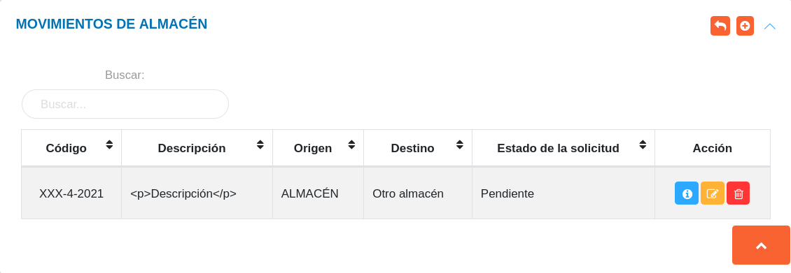

# Gestión de Movimientos en Almacén 
***********************************

## Movimientos de almacén

En esta sección se listan todos los registros realizados de movimientos o traspasos de artículos entre almacenes. A través de esta sección es posible **Crear** un nuevo registro, **Ver** información detallada del registro, **Editar** y **Eliminar** un registro. 

Figura: Movimientos de Almacén

**Estado de la solicitud**

Los **Estados de la Solicitud** que puede tomar un registro son: **Pendiente**, **Rechazado**, **Aprobado** o **Confirmado**;  permitiendo así, tener un seguimiento de las solicitudes para movimientos entre almacenes. 

Una vez se realiza una nueva solicitud esta toma el estado **Pendiente**, luego puede cambiar el estado como **Rechazado**, **Aprobado** o **Confirmado** dependiendo de la decisión del encargado de almacén.

### Crear una nueva solicitud

A través de esta funcionalidad se formula una nueva solicitud para traspaso de productos entre almacenes. 

**Para crear una nueva solicitud**

- Dirigirse al módulo de **Almacén**, luego a **Movimientos de Almacén** y ubicarse en la sección **Movimientos de Almacén**.
- Haciendo uso del botón **Crear** 
ubicado en la esquina superior derecha de esta sección, se procede a realizar una nueva solicitud.
- Se completa el formulario de registro de la sección **Nuevo Movimiento de Almacén**. 
- Se presiona el botón **Guardar**  ubicado al final de esta sección, y se verifica en la lista de registros en **Movimientos de Almacén**.

Figura: Nuevo Movimiento de Almacén

!!! warning "Advertencia"
	El usuario encargo de la gestión de almacén debe ser cuidadoso a la hora de registrar un movimiento, ya que debe tomar en consideración el número de existencia y el número de reserva que el insumo tiene asignado.  Si se excede en el número de reservas generadas por solicitud de acuerdo a la existencia del insumo el sistema generará un mensaje indicando el error. 

	

	**Consultar número de reserva y existencia del producto**

	Una vez se ingresa al formulario de **Nuevo Movimiento de Almacén** y se selecciona un almacén, cada **Insumo** indica información sobre su existencia y reserva en la columna titulada **Inventario**.

	

### Gestión de registros

Para **Ver información detallada**, **Editar** o **Eliminar** un registro se debe hacer uso de los botones ubicados en la columna titulada **Acción** de la tabla de registros en la sección de **Movimientos de Almacén**.  

## Movimientos de Almacén Pendientes

Esta sección lista todos las solicitudes que han sido **Aprobadas**, **Rechazadas**, o se encuentran **Pendientes** por revisar.	Desde esta sección el encargado de almacén o el usuario con permisos especiales, puede **Aceptar** o **Rechazar** solicitudes que se encuentran en el estado **Pendiente**.

Figura: Movimientos de Almacén Pendientes

### Aceptar solicitud

- Dirigirse al módulo de **Almacén**. 
- Ingresar a **Movimientos de Almacén**.
- Ubicarse en la sección **Movimientos de Almacén Pendientes**. 
- Haciendo uso del botón **Aceptar** 
ubicado en la columna titulada **Acción** de la tabla de registros se aprueba la solicitud.

### Rechazar solicitud

- Dirigirse al módulo de **Almacén**. 
- Ingresar en **Movimientos de Almacén**.
- Ubicarse en la sección **Movimientos de Almacén Pendientes**.
- Haciendo uso del botón **Rechazar** 
ubicado en la columna titulada **Acción** de la tabla de registros se rechaza la solicitud.

##Confirmar solicitud 

Una vez la solicitud ha sido aceptada y los artículos se encuentran disponibles se habilita la opción **Confirmar solicitud** en la columna títulada **Acción** de la tabla de **Movimientos de Almacén Pendientes**. 

###Confirmar solicitud

- Dirigirse al módulo de **Almacén**. 
- Ingresar a **Movimientos de Almacén**.
- Ubicarse en la sección **Movimientos de Almacén Pendientes**. 
- Presionar el botón **Confirmar** 
ubicado en la columna titulada **Acción** de la tabla de solicitudes.
- Ingresar una observación y presionar el botón **Guardar** para confirmar solicitud. 

Luego que la entrega ha sido confirmada la solicitud cambia su estado a **Confirmado** en la tabla de **Movimientos de Almacén**.

   