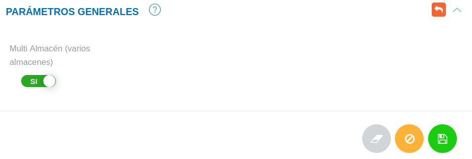

# Configuración Módulo de Almacén
********************************

## Parámetros generales

Desde está sección se activa la funcionalidad **Multi Almacén**, habilitando la gestión de varios almacenes.

Figura: Parámetros Generales

**Para activar la opción Multi Almacén**

- Dirigirse a la **Configuración** del módulo de **Almacén**.
- Ubicarse en **Parámetros Generales**. 
- Activar la opción **Multi Almacén** a través del botón de selección. 
- Presionar el botón **Guardar**  y verificar que se haya almacenado en la lista de registros.

	