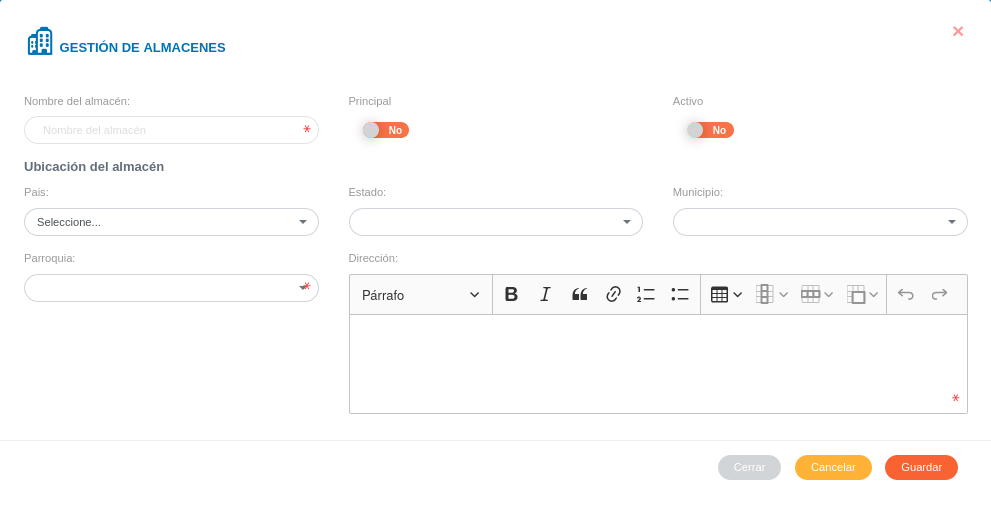

# Configuración Módulo de Almacén
********************************

## Configuración general de almacén 

A través de esta sección se realizan los registros iniciales del módulo de almacén, registros que serán usados en las demás secciones del módulo según la configuración que se realice.	De igual forma se pueden realizar ajustes sobre los datos ya existentes.  

Configuración General de Almacén 

### Almacenes

Desde esta sección se realiza la gestión de almacenes, esta opción permite registrar un nuevo almacén, editar o eliminar algún registro.

#### Crear un nuevo registro 

- Dirigirse a la **Configuración** del módulo de **Almacén**.
- Ingresar a **Almacenes** en la sección **Configuración General de Almacén**.
- Completar el formulario **Gestión de Almacenes **.   
- Presionar el botón **Guardar** y verificar que se haya almacenado en la lista de registros.

Figura: Almacenes

Figura: Registros de Almacenes

#### Gestión de registros  

A través de los botones ubicados en la columna titulada **Acción** de la tabla de registros, es posible **Gestionar Almacén**/**Dejar de Gestionar Almacén**, **Editar** o **Eliminar** un registro.

!!! failure "Dejar de Gestionar Almacén"
	

!!! success "Gestionar Almacén"
	
### Insumos

Desde esta sección se realiza la gestión de insumos, es posible realizar un nuevo registro, editar o eliminar algún registro existente.

#### Crear un nuevo registro

- Dirigirse a la **Configuración** del módulo de **Almacén**.
- Ingresar a **Insumos** en la sección **Configuración General de Almacén**.
- Completar el formulario **Registros de Insumos Almacenables**.   
- Presionar el botón **Guardar** y verificar que se haya almacenado en la lista de registros.

Figura: Formulario de Registro para Insumos Almacenables

Figura: Insumos

#### Gestión de registros

Para **Editar** o **Eliminar** un registro se debe hacer uso de los botones ubicados en la columna titulada **Acción** de la tabla de Registros.

#### Importar registros

Mediante esta funcionalidad es posible cargar los registros de insumos de forma masiva a tráves de una hoja de cálculo. Se sugiere que al momento de realizar una importación de registros, se sigan las recomendaciones que se señalan en esté manual para la funcionalidad importar registros.

**Funcionalidad para importar registros**

La carga de registros de forma masiva es una funcionalidad que se presenta en varios módulos de la aplicación. Es importante que el usuario encargado de hacer uso de esta funcionalidad tenga presente los parámetros y requerimientos a seguir para un correcto manejo de la misma. 

Se recomienda al usuario que va a importar un archivo; realizar antes una exportación de los registros (registros de productos) que se encuentran en el sistema. Esto le permitira al usuario editar esta copia del archivo de registros y usar esta información para realizar una importación.    

El formato de hoja de calculo establecido en el archivo a importar contiene una serie de columnas el cual deben estar identificadas, si el usuario ha exportado un archivo entonces este mantiene sus columnas identificadas por defecto y no es necesario cambiar algún valor.

Cada uno de los campos asociados a cada registro se encuentran identificados por un **id** el cual es un identificador único.

A continuación se muestra una tabla de registros con sus respectivos **id**. Para un nuevo registro basta solo con que el usuario complete los campos name (nombre del producto), description (descripción del producto) y measurement_unit_id (id de la unidad de medida); entonces el sistema completa de forma automática los campos faltantes.   

**Tabla de registros de productos**

|name|description|measurement_unit_id|measurement_unit|measurement_unit_acronym|measurement_unit_description| 
|--|--|--|--|--|--|
|Producto 1|Descripción|1|Bulto|bulto|Descripción de unidad de medida|
|Producto 2|Descripción|2|Caja|caja|Descripción de unidad de medida|
|Producto 3|Descripción|3|Galón|gal|Descripción de unidad de medida|
|Producto 4|Descripción|4|Litro|lts|Descripción de unidad de medida|
|Producto 5|Descripción|5|Metros cuadrados|mt2|Descripción de unidad de medida|
|Producto 6|Descripción|6|Metros lineales|m|Descripción de unidad de medida|
|Producto 7|Descripción|7|Paquete|pkg|Descripción de unidad de medida|
|Producto 8|Descripción|8|Quintal|qq|Descripción de unidad de medida|
|Producto 9|Descripción|9|Resma|res|Descripción de unidad de medida|
|Producto 10|Descripción|10|Servicio|srv|Descripción de unidad de medida|
|Producto 11|Descripción|11|Unidad|und|Descripción de unidad de medida|

Los **id** son generados cada vez que se realiza un nuevo registro en la configuración del módulo, es posible visualizarlos una vez se exporte un archivo de registros (registros de productos) desde el sistema. 

El archivo que el usuario ha exportado le permite editar esta infomación, es decir, puede actualizar cualquier registro que se ha realizado previamente.  Sin embargo, el manejo de este contenido se debe realizar con precaución, ya que los registros pueden encontrase asociados a través de sus **id**.  

!!! note "Nota"
	Las unidades de medida son registradas inicialmente en la **Configuración General del Sistema KAVAC**.

!!! warning "Advertencia"
	Los formatos permitidos para la carga de archivos son:  **csv**, **xls**, **xlsx** y **ods**.  

**Para importar registros**

- Dirigirse a la **Configuración del módulo de Almacén**.
- Ingresar a **Insumos** en la sección **Configuración General de Almacén**.
- Presionar el botón **Importar**  ubicado en la esquina superior derecha de esta sección.  
- Seleccionar el archivo del directorio local, para transferir a la aplicación.  
- Verificar que los registros se hayan almacenado en la lista de registros recargando la página.  

#### Exportar registros

Mediante esta funcionalidad es posible obtener una copia de todos los registros a tráves de una hoja de cálculo.

**Para exportar registros**

- Dirigirse a la **Configuración** del módulo de **Almacén**.
- Ingresar a **Insumos** en la sección **Configuración General de Almacén**.
- Presionar el botón **Exportar**  ubicado en la esquina superior derecha de esta sección.  
- Una copia del archivo se transfiere de la aplicación al equipo, este archivo contiene todos los registros de productos almacenados en el sistema.  

### Reglas de abastecimiento 

Desde esta sección se realiza la gestión de reglas de abastecimiento, es posible establecer un numero mínimo y máximo en el stock.  Para los artículos considerados como almacenables, esta herramienta permite contar con reglas para asegurarse de que los productos con mas demanda nunca queden sin existencias o superen el máximo establecido de stock. Además, desde esta sección es posible editar o eliminar algún registro realizado.

#### Crear un nuevo registro

- Dirigirse a la **Configuración** del módulo de **Almacén**.
- Ingresar a **Reglas de Abastecimiento** en la sección **Configuración General de Almacén**.
- Completar el formulario  **Reglas de Abastecimiento del Almacén**.  
- Presionar el botón **Guardar** y verificar que se haya almacenado en la lista de registros.

Figura: Reglas de Abastecimiento del Almacén

!!! warning "Advertencia"
	Para establecer las reglas de abastecimiento deben existir registros de ingreso al almacén, de esta forma el sistema va listar todos los productos almacenables para que el usuario indique cuál de esa lista se va ingresar al almacén.

#### Gestión de registros

Para **Editar** o **Eliminar** un registro se debe hacer uso de los botones ubicados en la columna titulada **Acción** de la tabla de Registros.

### Cierres de almacén 

Desde esta sección se realiza la gestión para cierre de almacén, es posible programar un cierre de almacén, editar o eliminar algún registro.

#### Programar un cierre de almacén  

- Dirigirse a la **Configuración** del módulo de **Almacén**.
- Ingresar a **Cierres de Almacén** en la sección **Configuración General de Almacén**.
- Completar el formulario **Nuevo Cierre de Almacén**.   
- Presionar el botón **Guardar** y verificar que se haya almacenado en la lista de registros.

Figura: Almacenes

#### Gestión de registros

Para **Editar** o **Eliminar** un registro se debe hacer uso de los botones ubicados en la columna titulada **Acción** de la tabla de Registros.

